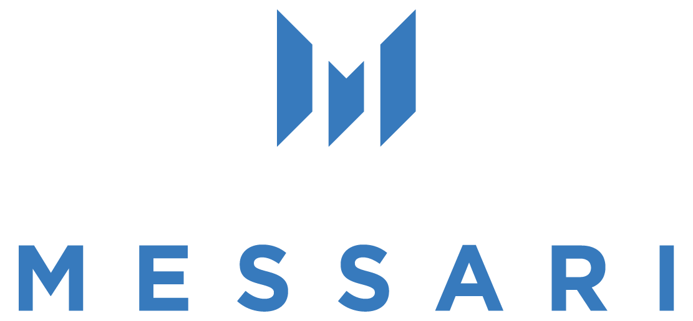

# Messari Standard Subgraphs &bull;   

  

Messari subgraphs set an industry leading standard for on chain data 🚀

Utilizing [The Graph](https://thegraph.com/) these subgraphs extract raw blockchain data and transorm it into meaningful metrics, for products and analytics.

## Working Environment

Go to [`docs/SETUP.md`](./docs/SETUP.md) to learn how to setup your machine for Messari subgraph development.

## Learn the Project

It is important to familiarize yourself with the project structure and tooling to build efficiently. Go to [`docs/STRUCTURE.md`](./docs/STRUCTURE.md) and [`docs/TOOLING.md`](./docs/TOOLING.md) to learn more.

- Familiarize youself with our schemas labeled `schema-{protocol type}.graphql`. Read more details in [`docs/SCHEMA.md`](./docs/SCHEMA.md)
- We update our schemas as necessary. You can find out about each upgrade in [`docs/CHANGES.md`](./docs/CHANGES.md)

## Becoming a Subgraph Developer

Becoming a good subgrpah developer will take patience and practice. The following resources are for developers of all skill levels to learn the ins and outs of subgraph development. 👾

- For a full walkthrough of our subgraph development process visit [`docs/WALKTHROUGH.md`](./docs/WALKTHROUGH.md).
- Resources for develoment of varying levels can be found in [`docs/RESOURCES.md`](./docs/RESOURCES.md).
- To learn about common errors, best error handling practices, and debugging see [`docs/ERROR.md`](./docs/ERROR.md)
- Subgraph performance is also a concern. Learn about indexing / querying performance by reading [`docs/PERFORMANCE`](./docs/PERFORMANCE.md)

## Contributing Guidelines

We welcome contributions from the community! You can point out or fix bugs, suggest changes, add new features, or add new subgraphs ✅.

- For bugs, features, or change requests please submit an [issue](https://github.com/messari/subgraphs/issues) following our [guide](./docs/ISSUES.md).
- General contribution guidelines and practices will be found in [`docs/CONTRIBUTING.md`](./docs/CONTRIBUTING.md)

## Development Status

You can find a visualizer with the status of all Messari subgraphs at [subgraphs.xyz](https://subgraphs.messari.io/)! The code lives under `./dashboard`.

> _Quick note_: the raw deployment status of all subgraphs lives in [`./deployment/deployment.json`](./deployment/deployment.json)

## Contributing Guidelines

- Decide which protocol you want to build a subgraph for.
- Fork this repository.
- Add a folder under `subgraphs` with the name of the protocol you want to work on.
- Copy over the corresponding schema from the root folder. For example, if you are working on a yield aggregator, you should copy over `schema-yield.graphql` to your folder and rename it to `schema.graphql`. Note `schema-common.graphql` is used for schema design and reference, and should never be used for implementation.
- Build the subgraph within that folder. Feel free to use the [reference subgraph](./subgraphs/_reference_/) as a reference.
- Submit a PR (pull request) to this repo after you are done. Make sure you submit your PR as a draft if it's a work-in-progress. Include a link to your deployment in your PR description.
- If there are errors on any production subgraph (seen on "[protocol metrics](https://messari.io/protocol-explorer/all-protocols)") please reference the firefighting [docs](./docs/ProductionErrors.md) to efficiently solve the problem!

## Recommended Development Workflow

- Start with understanding the protocol. An easy start could be interacting with the protocol UI on testnets, check transaction details on Etherscan and pay attention to key events that are emitted.
- Go over the smart contracts. Identify the ones that we need to pull data from.
  - Usually each protocol has a factory contract that's responsible for tracking other contracts (e.g. Uniswap's Factory contract, Aave's Lending Pool Registry, Yearn's Registry).
  - Also a pool/vault contract that's responsible for pool level bookkeeping and transactions (e.g. Uniswap's Pair contract, Yearn's Vault contract, Aave's Lending Pool contract).
- Go over the schema and think about what data are needed from smart contract events/calls to map to the fields in each entity.
  - It's easiest to start with more granular entities and build up to aggregated data.
  - For example, usually it's easier to start writing mappings for transactions and usage metrics.
- Go over the documents in the `docs` folder. That should answer lots of questions you may have.
- Implement the mappings, deploy and test your data using either Hosted Service or The Graph Studio.
- For metrics calculation (e.g. revenue, fees, TVL), please refer to the `README.md` in the protocol's subgraph folder for methodology. There is also a broader explanation of how different fields are defined in the schema in `docs/Schema.md`. Feel free to reach out to me if anything isn't clear.
- We've built a handy debugging/validation dashboard for you to quickly visualize the data in your subgraph. It's deployed to [subgraphs.xyz](https://subgraphs.xyz/) and the source code is under `dashboard` if you want to spin it up locally.
- There is also a cli-tool called `messari-cli`. It utilized The Graph CLI and exploits the standard directory structure to template and prepare subgraph deployments for you with simple commands. You can learn more about installing and using the CLI by looking at the README.md within the `messari-cli/docs` folder.
- Verify your subgraph against other sources and include specific links to these sources in the README. Below are some common sources:
  - Project's official analytics dashboard
  - [DeFi Llama](https://defillama.com/) (for TVL)
  - [Dune Analytics](https://dune.xyz/)
  - [TokenTerminal](https://www.tokenterminal.com/terminal)

> For other contributing guidelines, please refer to [Contributing.md](./docs/Contributing.md)

## Video Walkthrough Series of Subgraph Development Workflow for Messari

**CLI Installation:**

- `npm install -g messari-subgraph-cli`
- `npm install -g mustache`

**Deployment.json Walkthough:**

**Standard Directory Structure Walkthrough:**

**How to use Messari Subgraph CLI and Explanation:**

## Resources

### Introductory

- Learn the basics of GraphQL: [https://graphql.org/learn/](https://graphql.org/learn/)
- Query subgraphs using GraphQL: https://thegraph.com/docs/en/developer/graphql-api/
- Get familiar with The Graph: [https://thegraph.academy/developers/](https://thegraph.academy/developers/)
- Defining a subgraph: [https://thegraph.academy/developers/defining-a-subgraph/](https://thegraph.academy/developers/defining-a-subgraph/)
- Creating a subgraph: https://thegraph.com/docs/en/developer/create-subgraph-hosted/
- Deploying a subgraph using The Graph Studio: [https://thegraph.com/docs/en/studio/deploy-subgraph-studio/](https://thegraph.com/docs/en/studio/deploy-subgraph-studio/)

### Intermediate

- [AssemblyScript API](https://thegraph.com/docs/en/developer/assemblyscript-api/)
- [Unit Test Using Matchstick](https://thegraph.com/docs/en/developer/matchstick/)
- [Building a Subgraph for Sushiswap](https://docs.simplefi.finance/subgraph-development-documentation/sushiswap-subgraph-development)
- [Building a Subgraph for Loopring](https://www.youtube.com/watch?v=SNmzhwlQqgU)
  - Using templates (dynamic data sources)
  - Indexing proxies

### Advanced

- Building ambitious subgraphs (Part I): https://www.youtube.com/watch?v=4V2o5YJooOM
  - Schema design
  - Error handling
  - Interface and union types
- Building ambitious subgraphs (Part II) https://www.youtube.com/watch?v=1-8AW-lVfrA
  - Performance tips and tricks (for both mappings and queries)
- [Documentation for the graph-node](https://github.com/graphprotocol/graph-node/tree/master/docs)
