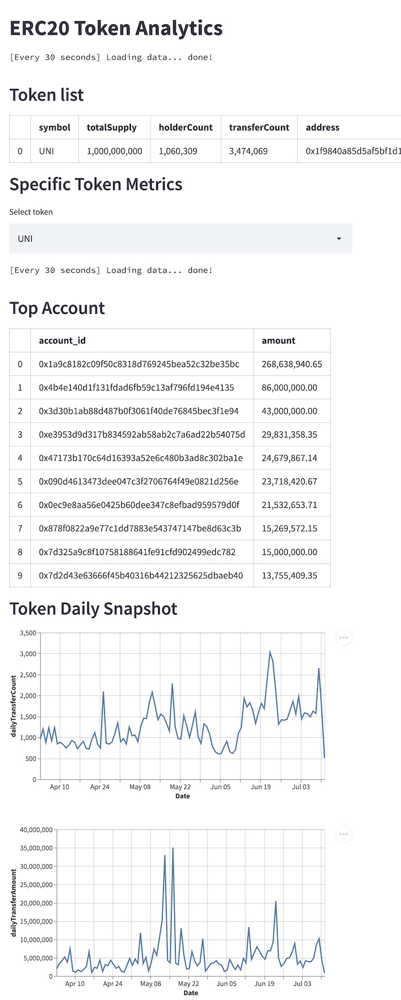

# ERC20 Token Analytics



## Development

Install venv

```
python3 -m venv venv
```

Activate venv

```
source venv/bin/activate
```

Install dependencies

```
pip3 install -r requirements.txt
```

Run locally

```
streamlit run app.py
```
