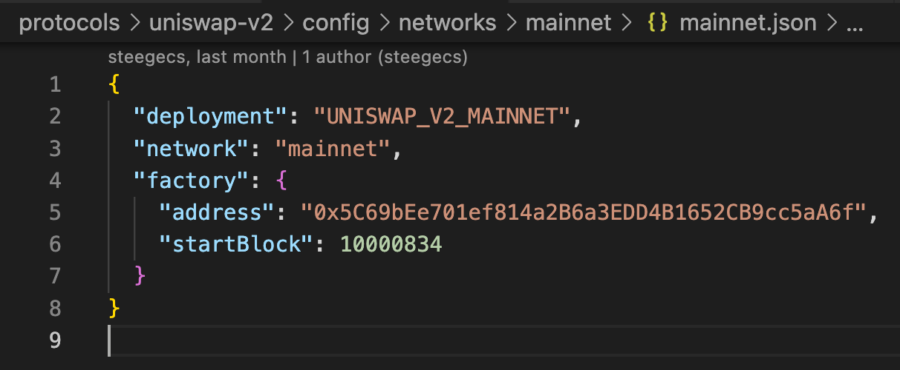
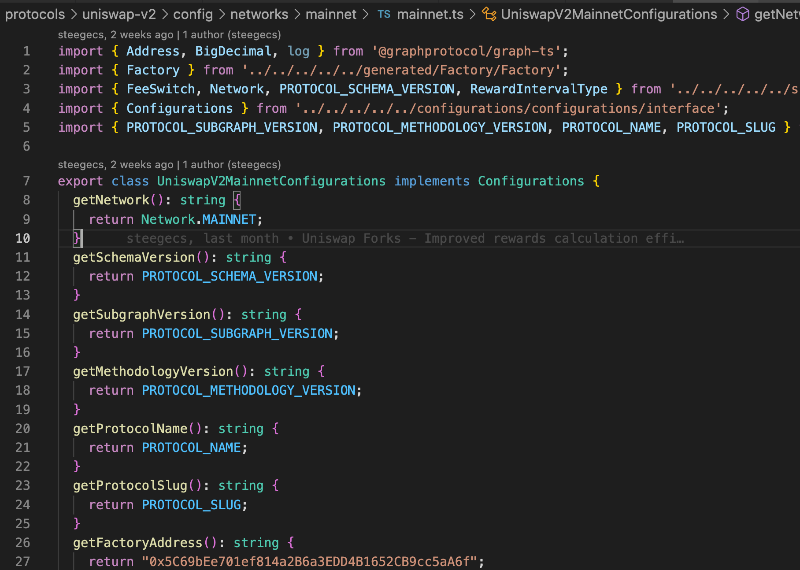
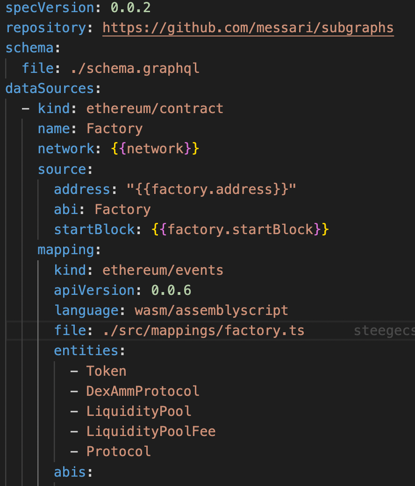
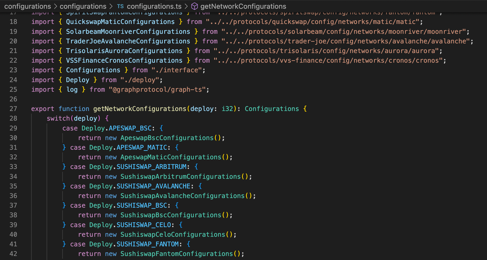
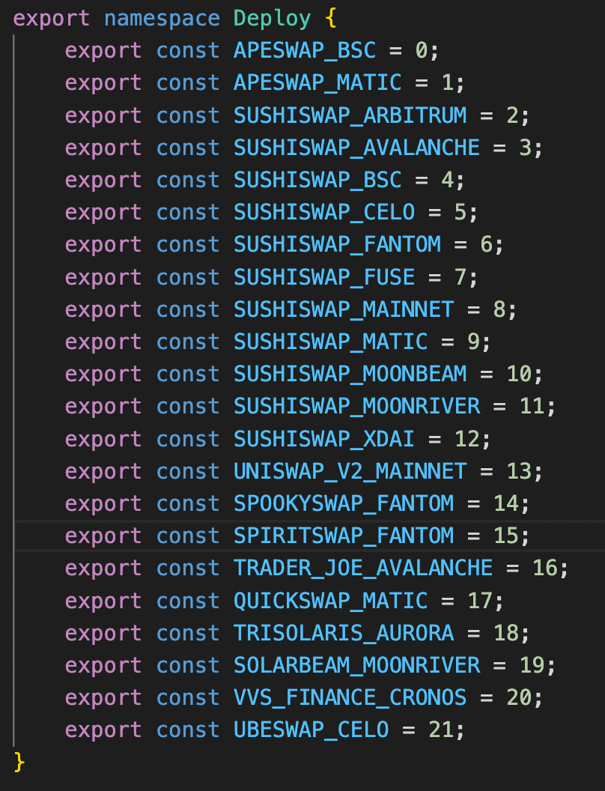
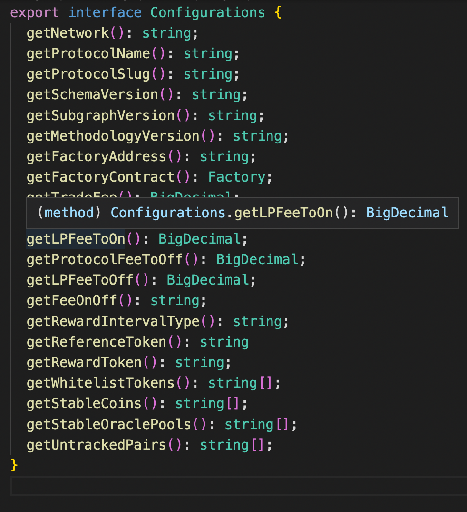
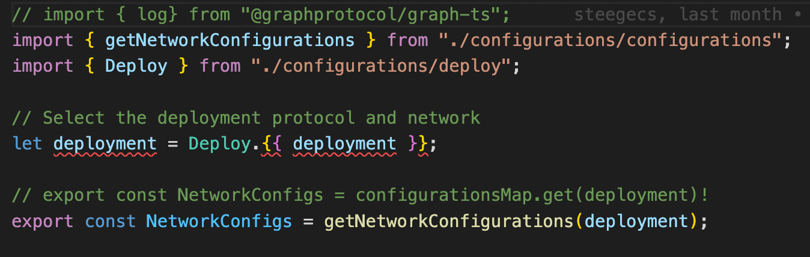
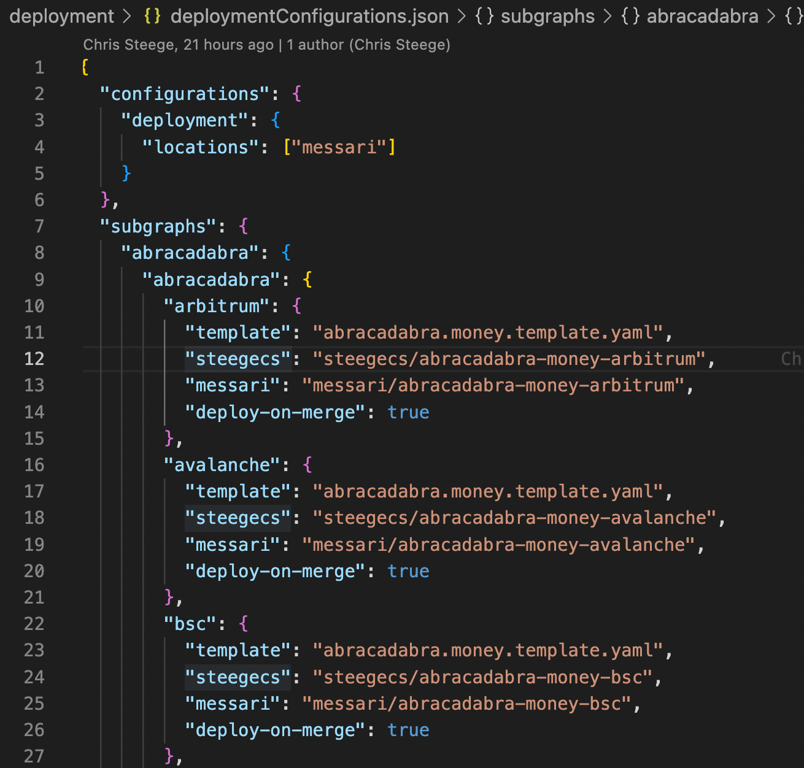

## Deployment Instructions:

```
# Deploys uniswap-v2 from the uniswap-forks to mainnet in my hosted service.
npm run deploy --SUBGRAPH=uniswap-forks --PROTOCOL=uniswap-v2 --NETWORK=mainnet --LOCATION=steegecs

# Deploys uniswap-v2 from the uniswap-forks to all networks in my hosted service.
npm run deploy --SUBGRAPH=uniswap-forks --PROTOCOL=uniswap-v2 --LOCATION=steegecs

# Deploys protocols from the uniswap-forks and networks in my hosted service.
npm run deploy --SUBGRAPH=uniswap-forks --LOCATION=steegecs
```
- 2 required parameters:
    - --SUBGRAPH
    - --LOCATION

- 2 Additional Parameters for specifying particular deployments from a subgraph directory.
    - --PROTOCOL
    - --NETWORK
    
- 2 Options (Leaving null means 'F')
    - --PRINTLOGS
        - T/F - Set PRINTLOGS to 't' or 'true' to print all logs to the console instead of just to results.txt
    - --MERGE
        - T/F - Specifies whether this deployment is triggered by a merge. Should only be set to merge in the deployment action unless for testing.


- This works by taking the inputs from `npm run deploy` and using them to configure the subgraph.yaml, and optionally, configurations/configure.ts with a particulalar set of constants, and subsequently deploying to the specified hosted service account.

## How CI/CD deployment works:
- The CI/CD deployment scripts and actions allow you to deploy multiple subgraphs at a time and deploy on merge if specified in the deployment/deploymentConfigurations.json file. 
- The subgraphs that get deployed on merge depend upon 2 conditions: 
    - The `deploy-on-merge` variable in the `deploymentConfigurations.json` should be present and set to `true` for that particular protocol and network deployment.
    - A change in the codebase is detected that is relevant to a particular subgraph. For example: 
        - A change in the `src/` folder has an expected impact on all subgraphs in the directory, so all subgraphs will satisfy this condition and deploy on merge if the above condition met.
        - A change in a particular Protocols/`protocol`/src/ folder, will trigger all deployments for a particular protocol if the above condition is met. 
        - A change in a particular Protocols/`protocol`/config/networks/`network` folder will deploy that specific protocol and network if the above condition is met.
- Be careful to set the deploy-on-merge to its proper configuration each time you create a PR and merge it to the remote repository.

## How to set up:
### Directory Structure (See uniswap-forks as example): 
- Using these scripts requires a particular directory structure. This is because when the `npm` scripts are executed, the deployment scripts should know where to look for configuration files and templates. Also, for the deploy-on-merge actions, the specific structure allows us to detect changes that may apply to specific subgraph (root directory of subgraph e.g. uniswap-forks), a specific subgraph and protocol, a specific subgraph protocol, and network, or some combination. This is then used to execute the particular subgraph deployments that have relevant changes if specified in `deployment/deploymentConfigurations.json` to the Hosted Service. 

- The folder structure is a minimum **requirement**. You can add additional folders and files as long as the general pattern is adhered to: 
    - First, you should have a `src/` folder and add any code or constants that applies to all subgraphs.
        - Example Strucure:
            - src/
                - common/
                    - constants.ts
                - mappings/
                    - ...
                - price/
                    - ...
        - This constants file should contain all constants that do not conflict accross protocols and networks. See subgraphs/uniswap-forks/src/common/constants.ts as an example.  

    - Additionally, within the particular subgraph folder, you should have a `Protocols/` folder. The directory structure should have each of these folders and files (configured by `protocol` and `network`).
        - Protocols/ (contains a list of all protocols developed in this directory) 
            - `protocol`/
                - config/
                    - networks/
                        - `network1`/
                            - `network1`.json
                        - `network2`/
                            `network2`.json
                    - templates/ (make sure there are not dashes (-) in `protocol` to help with programmatically accessing the file)
                        - `protocol`.template.yaml
                - src/
                    - common/
                        - constants.ts
                    - mappings/
                        - ...

        - Protocols/`protocol`/config/networks/`network`/`network`.json contains all parameters used to configure the proper template in Protocols/`protocol`/config/templates using mustache

    - (Option) If you want to introduce protocol and network specific configurations for use by the program, add a `configurations` folder and add `network.ts` file to Protocols/`protocol`/config/networks/`network`/:
        - configurations/
            - configurations/
                - configurations.ts
                - deploy.ts
                - interface.ts
            - configure.template.ts

### Necessary Files 
- *Protocols/`protocol`/config/networks/`network`/`network`.json*
    - 
    - Add all necessary mustache configurations for Protocols/`protocol`/config/templates/`template`.yaml and configurations/configure.template.ts
    - If using a configurations/ folder for protocol and network specific constants, add a constant of the form to the `network`.json file: 
        - "deployment": "{PROTOCOL_SLUG}_{NETWORK}"
- *Protocols/`protocol`/config/networks/`network`/`network`.ts*
    - 
    - Add an object containing configurations for a specific protocol/network deployment. Recommended to use Protocols/`protocol`/src/constants.ts and src/constants.ts for imports if applicable (e.g. for importing PROTOCOL_SUBGRAPH_VERSION or PROTOCOL_FACTORY_ADDRESS).
- *Protocols/`protocol`/config/templates/`protocol`.template.yaml*
    - 
    - Contains the template that will be used to create the subgraph.yaml in the subgraph directory - usually 1 per protocol but not always. 
- *package.json*
    - Contains the `npm` scripts necessary to succesfully run the deployment scripts as shown in the instructions above. 
    - Should contain at least:
        - `prepare:yaml`
        - `prepare:constants` (Option)
            - Use if you added a configuration/ folder
        - `prepare:build`
        - `deploy:subgraph`
        - `deploy`
    - See `deployment/package.template.json` at the head of the repo to get the scripts.
    - The `prepare:yaml` and `prepare:constants` scripts take arguments the tell them the proper locations to look for configurations and configurable files and generates configurations from templates. The `subgraph:deploy` script takes a deployment location as an argument and deploys to the Hosted Service at that location. 
    - All you have to do is pass the relavent paramters to the `deploy` script described in the instructions above, and other scripts are configured and run as needed.
- *configurations/*
    - *configurations/*
        - *configurations.ts*
            - 
            - Contains imports for instantiated configuration objects in Protocols/`protocol`/config/networks/`network`/`network`.ts.
            - Import a configuration object for each particular protocol and network and add to switch case
        - *deploy.ts*
            - 
            - Contains a namespace for {PROTOCOL_SLUG}_{NETWORK} used in configure.template.ts
            - Add a namespace value for each deployment that uses the configurations/ folder.
        - *interface.ts*
            - 
            - Contains an interface used to describe all configuration fields used by the program for all subgraphs in the directory. 
            - Add or delete fields as necessary. 
    - configure.template.ts
        - 
        - This file is used to generate configure.ts which selects the proper configurations for a protocol/network deployment.

- *HEAD:/deployment/deploymentConfigurations.json*
    - This file contains deployment configurations for each protocol and network deployment. 
    - Add an entry to this file for each protocol and network deployment
    - 
    - Stick to the current structure of the json file
        - `subgraph folder` (e.g. uniswap-forks)
            - `protocol` (e.g. uniswap-v2)
                - `network` (e.g. mainnet)
                    - template (Required)
                        - file name of the template used for this deployment (e.g. uniswap.v2.template.yaml)
                    - `location` (Optional) 
                        -Specify the deployment location in the hosted service if the deployment location name does not follow the Messari standard (account/protocol-network)
                    - deploy-on-merge (Optional)
                        - true/false/null
                        - Set to true if you want to deploy upon merging your branch with remote repo
                        - Does not deploy unless true
                    - prepare:constants (Optional)
                        - true/false/null
                        - Set to true if you are configuring constants in the configurations/ folder.
                        - Does not use unless true
