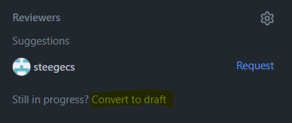
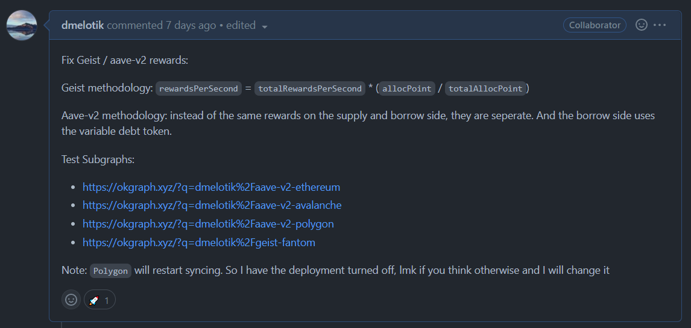

# Contributing

This document is designed to act as an outline for the process of contributing to the project. You will find some workflow tips, naming conventions, and other useful information. A standard process will increase productivity.

## Outline

As you begin adding code to the repository you will notice there is a lot of code. And we have a standard naming convention for folders and files that you should follow.

1. Fork the repository, and keep your `master` branch the same as `messari/subgraphs`, before creating a feature branch in your repository **pull** upstream changes.
2. Create your feature branch `branch-name`.
3. Once you begin to **push** changes create a Pull Request (PR) in `messari/subgraphs` and set it as a draft until you it is ready for review.



> See "Naming Conventions" for how to name your PR

4. Once your PR is ready for review go ahead and click "Ready for review". As a courtesy it is nice to let the reviewer know that it is ready through a DM.

At this point you will just need to follow the "Reviewing" process until your PR is merged.

## Reviewing

### Reviewee

- Generally you will need to make changes, either respond to a change/comment with a question, rebuttle, or comment. Otherwise, make the change and resolve the issue.
- When you feel changes are sufficient, let the reviewer know again that the PR is ready for another round of reviews.
- Do not make a new PR for changes, this will make it harder for the reviewer to track their progress.

### Reviewer

- This part is straight forward, and if you are reviewing you know what to do.
- It is courtesy to let the developer know that you are done with the review.
- The reviewer is generally assigned by Vincent (@this-username-is-taken)

> This is an iterative process that takes time, so don't think it will always be easy.

## Rebasing

### Why rebase?

Whenever there are merge conflicts you should rebase *instead* of merge. The reason for this is that it keeps a clean working history. 

How does this happen?

The version of `master` you initally branched off is not the current version. New commits have been added, and some of them conflict with your changes. Answer: rebase.

Sometimes you need to make a change based off a `feature-branch` that hasn't been merged into `master` yet. Once `feature-branch` is merged into `master` you want to rebase onto `master` to clean up the branch commit history. 

### How to rebase:

There are multiple ways to do this. Most of the time you will rebase onto `master`, so you should make sure your `master` branch is up to date with the upstream `master` (ie, Messari's repo).

Go into your feature-branch and make the following call.

```bash
git pull --rebase origin master
```

This will initiate a rebase. Sometimes you will have to resolve conflicts. And then `git add .` and `git rebase --continue` or `git rebase --skip`.

Following this method, after rebasing you can do the command `git push --force` to update your remote repo.

## Pull Requests

In general you want to keep PRs small when possible. This way it is easier to review and if a breaking change is merged it is easier to go back and not mess up a lot of history.

### What should be included in a PR?

To keep PRs small follow thse guidelines, and use them to make educated choices about other scenarios you might run into:

- If you are formatting code outside of the scope of your PR it should be in a separate PR
- Isolate bug fixes into individual PRs, do not combine them. If they depend on each other use your judgement if they should be together or not. You can always branch off a `feature-branch`
- Use a single PR for each feature (ie, a new subgraph has it's own PR)

### Merging

For now after a PR is reviewed Vincent (@this-username-is-taken) does the final merge into `master`.

### PR Comments

It is nice to outline the changes / fixes you made in your PR. This way the reviewer knows what to look for and what to expect.

If the change affects a subgraph you should make a link to your testing subgraph in https://okgraph.xyz/. This website is a great hub for subgraph viewing (shoutout @0xbe1).

An example of good PR heading comments:



> Sometimes a PR is so small or the name is self explanatory and a descriptive comment is not necessary. See [#715](https://github.com/messari/subgraphs/pull/715). Use your judgement and ask questions if you want to learn and grow as a team!

## Naming Conventions

### How to name your PR

It is nice to have a consistent naming convention for pull requests. Oftentimes there are dozens of PRs out on `messari/subgraphs` so being able to know exactly what a PR is is important.

PR names also drive the commit name once a PR is merged into `master`. In this way it is easier to tell what was changed in each commit.

The impact level identifiers are based on semver versioning. So you can use #`name` to help prefix and categorize your PR. Read more about semver changes [here](https://semver.org/#summary).

### #patch

This change is generally a bug fix, and does not break anything. ie, it is backwards compatible.

### #minor

This is a change that adds a new feature, but still remains backwards compatible.

### #major

This change is usually a big update as it will not be backwards compatible with the previous code.

### Additional identifiers

In addition to the version impact level you can identify a change with words to be more descriptive. In some cases a change doesn't really fit into the semver system. For example, adding this to the docs.

Some other naming identifiers:

- `fix` - bug fix
- `feat` - new feature
- `chore` - chores (like updating README.md)
- `docs` - adding to the docs
- `style` - fix folder/file names or syntax formatting
- `refactor` - update logic, but the program performs the same way
- `perf` - add performance
- `test` - add a test

> If you find yourself wanting to name a PR with multiple of these identifiers you should probably make a PR for each one.

### How to name a PR

"`identifier`(#`semver-change`); `subgraph-name`; `description`"

> Ideally you want the `description` to be short and sweet.

Examples:

- "fix(#major); compound forks; upgrade to 2.0.1 schema"
- "feat(#minor); dashboard; add tvl to front page"
- "chore(); README; update comp version"
- "fix(#patch); abracadabra; fixing issue #420"
- "docs(); contributing; add Contributing.md"
- "refactor(#patch); aave-v2-forks; update reward logic"
- "style(); uniswap; format code"
- "perf(#patch); spookyswap; find value without contract call"

> Notice: some of the names don't have a #`semver` name. This is because they don't actually affect the versioning on any of the subgraphs / dashboard. A good way to know which semver identifer to use is to notice which part of the version you are updating. And it looks like this (MAJOR.MINOR.PATCH)!
