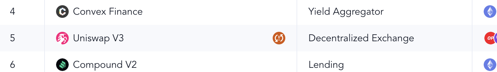
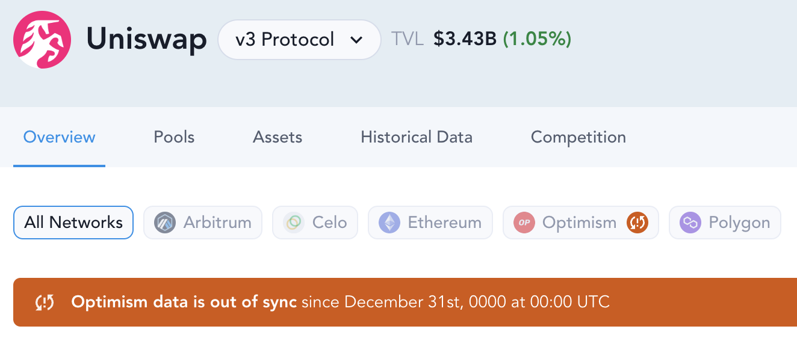
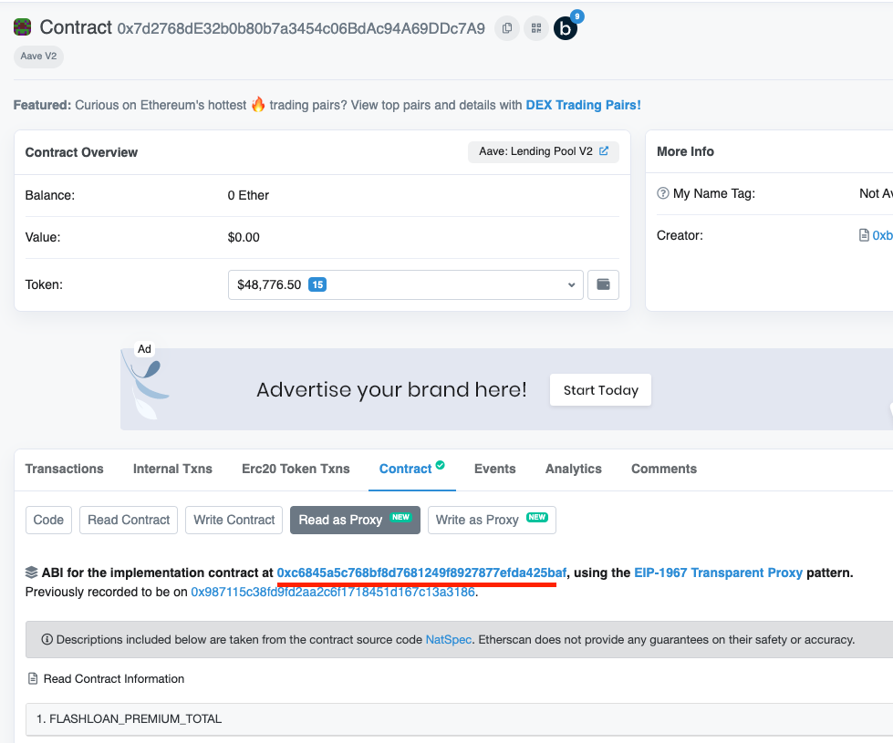
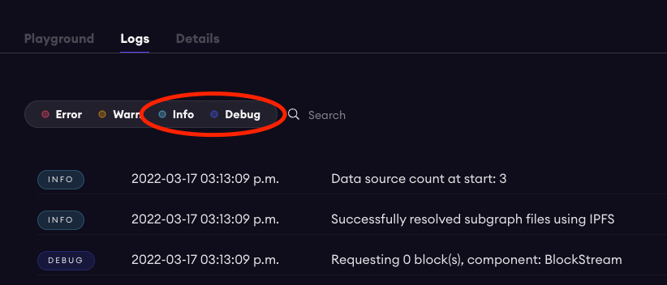

# Errors

This document will help you with common errors, how to handle errors, and known issues plus workarounds.

## Error Squashing Methods

_Note_: If you are the first to discover the error, please raise it to the team in `#development` on Discord.

It is inevitable that there will be errors in production subgraphs! This document describes how to be the first to catch the errors, and correct them efficiently.

### Catching Errors

There are two types of errors we are concerned about.

1. Fatal errors (the subgraph stops indexing)
2. Data errors (something in the data is now incorrect, e.g. oracle breaks)

### Where to look

Fatal errors will be apparent, if you see an error message in [Protocol Metrics](https://messari.io/protocol-explorer/all-protocols) that looks something like the following:





Data errors will be less obvious and more nuanced. It is possible that there is an error, but we decide not to fix it. For example, in Compound V2 we chose to not fix the ETH price when a proposal they passed broke it. This was what actually happened on chain.

> If you find this it should be added to the methodology `README.md` document in a protocol directory. We aim to be as transparent as possible!

To find these errors, you may notice it by browsing [Protocol Metrics](https://messari.io/protocol-explorer/all-protocols). But it is more likely you will be notified on the Discord [monitor bot](../monitor/README.md).

### How to Setup the Monitor

In order to get notified of production errors (without the noise) follow these steps:

1. Navigate to `#data-validation-bots` in the Subgraphs discord.
2. Mute the channel.
3. Jump into the `Production Ready Subgraph Indexing Failures` thread.
4. Unmute this thread.
5. Congrats! Now you will get notified of production errors here.

### Fixing Errors

> As these subgraphs are in production we want to be efficient and solve the problems swiftly to reduce downtime.

You will need to use your subgraph debugging skills, but here are some tips to help!

- Read the rest of this document for more error details.
- Focus on only solving the issue causing the error.
  - If you find other things (nice job), those can be solved in a separate PR after the error is fixed.
- Log in as many spots as possible to narrow down the issue (generally it will be isolated since the subgraph is QA'd)
- If it is taking more than 2-3 hours of debugging time, it is safe to skip that block (if that fixes it).
  - Use your judgement when it comes to this. And if you do this, please make sure you go back after the fact to continue to try and diagnose the issue.
- The graph's [docs](https://thegraph.com/docs/en/) also have a lot of information and are easily searchable
- Ask questions in our Discord or [The Graph's Discord](https://discord.gg/jxMUPqbAzr)

> Logs only seem to stay for ~1 hour before being cleared. If you need to keep persistent logs see our logging dashboard [tool](./TOOLING.md#logging-dashboard)

### Grafting

Grafting is a feature that allows you to copy the data of an existing subgraph (on the hosted service) to a new subgraph at any given block. This is useful when a bug is millions of blocks into the indexing. It is likely much faster to graft right before the affected block. To graft follow the docs [here](https://thegraph.com/docs/en/cookbook/grafting/)

In the case of our subgraphs you want to setup grafting by adding it into the `.yaml` template and the configuration. [This commit](https://github.com/messari/subgraphs/pull/1381/commits/cc63949bc06f95399cd3b7b63c206ae8b3842f1b) does exactly that. The same setup can be copied.

### Once Solved

Once you have the issue solved, make sure we have it deployed to a Messari production subgraph endpoint.

> Ideally you will want to graft as it is generally faster than indexing from the start.

Once it is fully synced and the issue is fixed:

- Notify a Messarian to backfill the data.
- If you are a Messarian (or have access) please backfill the data, and check to ensure it is fixed ✅

Happy debugging (Don't stress it too much)! 💻

## Common Errors

### Proxy

Some protocols use proxy contracts for upgradeability. Note that when handling proxy contracts, you should use the ABI of the implementation contract instead of the proxy contract. For example, Aave v2 uses a proxy for its Lending Pool contract: https://etherscan.io/address/0x7d2768de32b0b80b7a3454c06bdac94a69ddc7a9#code

You should navigate to the implementation contract first (Contract -> Read as Proxy -> Address underlined in red) and use the ABI there:



### Price Oracles

See [docs/Oracles.md](./Oracles.md)

### Functions with Multiple Return Values

Some functions in a smart contract can have multiple return values. You can bind the contract and make the function call as usual. However, the return values are embedded in `retval.value0` and `retval.value1` etc.

### Failed Transactions

Failed transactions are not indexed by `graph-node` and should not invoke any event handlers or call handlers. However, people have reported issues where they've seen failed transactions before (likely because of an inner call reverted). For example: https://discord.com/channels/438038660412342282/548982456414371850/892721444507774996.

If you run into one of these issues, feel free to let me know and I can report it to The Graph's dev team for investigation.

### Nested Calls

Nested calls (e.g. calls from a multi-sig wallet) still invokes call-handlers and event-handlers regardless of how deep the nesting is.

### Snapshots

If no event occurred throughout the duration of a snapshot, you can skip that snapshot.

### Saving Entities

It is safe to load and save an entity multiple times during the execution of some event or call handler. Changes won't be persisted to the DB until it ends, but they'll be cached in memory and loading a previously saved entity should contain those changes.

Be careful with loading the same entity in two different places at the same time. If both are saved at different places with different changes, it might happen that the second save overwrites the first. If you need to access the same entity in two different places try to load it just once and pass it down instead.

Sometimes it might feel like an entity is not being saved. If it is not caused by what was mentioned above, double check if something else might be updating the same field on that entity. It might actually be saved, but be overwritten by a different handler triggered by a different event on a different block.

### Array Sorting When Querying

When you query via GraphQL some entity which contains an array of non-native entities (not bigints, strings, etc ...), the items inside that array will be returned sorted in ascending order. But if you query from the mapping you'll get the array sorted in the same way it was when saved.

Some fields in some of our entities are arrays that contain information complementary to that of other fields. For example, in DEXes, pools have 2 or more input tokens. Each pool has a certain amount of each of those input tokens. The way we save this information is by having an array `inputTokens` containing the token addresses, and an array `inputTokenAmounts` containing the amount the pool has of each token. Each value in `inputTokens` maps to one in `inputTokenAmounts`, sharing their index in the array. In other words, the amount of `inputTokens[N]` in the pool will be `inputTokenAmounts[N]`, for any given `N`.

Since the GraphQL API will sort `inputTokens` in ascending order, its values might not map with the values in `inputTokenAmounts` (even though they did match when saved). Fields that behave in this way need to be sorted from the subgraph, ensuring the order is always the same, so positions don't get messed up. Using the same example, before saving `inputTokens` we should already sort them in ascending order and then map to `inputTokenAmounts`.

### Snapshot Interest Rates

When building a subgraph to our lending schema you will notice `InterstRate`s in our daily and hourly snapshots. If you copy the rate from the market like you would `totalValueLockedUSD` you are creating a pointer to that rate, which gets updated frequently. As a result you will see every snapshot shares the same `InterestRate` entity so historical rates are missed.

To combat this you need to create a new entity for each snapshot. To do this you can append `{# of days/hours since epoch time}` to the end of a rate entity to create daily/hourly copies. You can find an example of this in [compound-forks.getSnapshotRates()](../subgraphs/compound-forks/src/mapping.ts)

## Known Issues

Here are some known issues with subgraph development that you may run into:

### Subgraph Issues

- Using a `derivedFrom` field in the graph code gives no compile time issues but fails when the graph syncs with error `unexpected null wasm` ([Github Issue](https://github.com/graphprotocol/graph-ts/issues/219))
- Event data can be different from contract call data as event data are calculated amid execution of a block whereas contract call data are calculated at the end of a block.
- Note that **call-handlers** are not available on some EVM sidechains (e.g. Avalanche, Harmony, Polygon, etc). So you won't be able to use **call-handlers** in your subgraphs when indexing on these chains.
- As of [`graph-cli v0.26.0`](https://github.com/graphprotocol/graph-node/releases/tag/v0.26.0) there is a new environment variable called `GRAPH_MAX_GAS_PER_HANDLER`. This sets a maximum gas limit on handlers. This does not refer to on-chain gas limits, but a measure of the computation exerted per handler. You will get a subgraph error if this limit is exceeded.
  > A place you may find this is using the built-in `.pow()` with large numbers.
- Different graph-cli versions handle missing required fields defined in schema differently. Deploying a subgraph with missing required field with [`graph-cli v0.30.1`](https://github.com/graphprotocol/graph-node/releases/tag/v0.30.1) will fail with error `missing value for non-nullable field`, while it will succeed with [`graph-cli v0.26.0`](https://github.com/graphprotocol/graph-node/releases/tag/v0.26.0) as it automatically sets default values for those missing fields.

### AssemblyScript Issues

- When updating an entity array, you cannot use `array.push()` or `array[0] = ...` on the entity's field directly. Instead, you need to assign a new array to the entity array. See [details](https://thegraph.com/docs/en/developer/assemblyscript-api/#updating-existing-entities).
- Initialize array using `let a = new Array<T>()` instead of `let a = []`. See [details](https://www.youtube.com/watch?v=1-8AW-lVfrA&t=3174s).
- Scope is not inherited into closures (can't use variables declared outside of a closure). See [details](https://www.youtube.com/watch?v=1-8AW-lVfrA&t=3243s).
- Private global variables in classes are not supported. You can still make them, but there is no way to prevent a class object from directly changing private class variables. See: [https://www.assemblyscript.org/status.html#language-features](https://www.assemblyscript.org/status.html#language-features)

## Debugging

### Debug Logs

One of the most useful tools to debug is the `log` function in `@graphprotocol/graph-ts`. You can use it like follows in your mapping code:

```
log.debug('[Test Log] arbitrary argument {}', [123]);
```

which will show up in the Logs tab of Subgraph Studio:



You also have an option of `Error`, `Warning`, `Info`, `Debug` as the log level. I like to use `Warning` so that I can quickly filter for it. The way to filter for logs of a specific level is to click (uncheck) the log levels circled in red above.

**Note**: there is a known issue where historical logs are only kept for an indeterminate amount of time (usually an hour or so). Which means it's difficult to search for historical logs. The workaround is to run `graph-node` locally and deploy your subgraph locally (see instructions below), this way you have access to all your historical logs in the console.

### Indexing Status

You can check the indexing status of your subgraph and surface indexing errors that you may encounter along the way here: https://thegraph.com/docs/en/developer/quick-start/#5-check-your-logs

**Note**: you should use (copy/paste) this endpoint when you use the GraphiQL playground: https://api.thegraph.com/index-node/graphql. If you click into it, it's going to direct you to a different URL which won't work with the GraphiQL playground.

#### Subgraph fails to sync without error message

If you're having issues with the subgraph sync failing and no error messages shown in the log, you can access the **Indexing Status** of your subgraph to get more details. See steps are similar to above:

1. Check your graph health here https://graphiql-online.com/. Where it says "Enter the GraphQL endpoint" copy paste this endpoint https://api.thegraph.com/index-node/graphql
2. After running this, copy the sample query in section 5 of the graph docs here https://thegraph.com/docs/en/developer/quick-start/#5-check-your-logs into the window
3. Replace the part where it says subgraphs: ["Qm..."] with your deployment id (you will see this in the studio)
4. Run the query, you will see if your subgraph had any indexing errors!

### Debugging sync failing due to "oneshot cancelled" error

If you run into a subgraph sync fail with `Mapping terminated before handling trigger: oneshot canceled` or `Mapping terminated before passing in trigger: send failed because receiver is gone` message, usually the message is not helpful in pinning down the underlying cause. [Some discussion](https://discord.com/channels/438038660412342282/438070183794573313/1024382444197134447) on the graphprotocol discord server suggest a few possibilities include: trying to use foreach, not using a recent version of the graph-cli. It is a good idea to make sure those are not the case in your deployment.

Beyond these two possible causes, these are the steps you can take to narrow down the cause:

1. Find the tx hash that causes your subgraph to fail and the block number. They can be found in the error message.
2. Check the tx hash on etherscan for events it emits and figure out the most likely handler function where your subgraph that fails.
3. Add logs to the handler function where the error likely to happen, or you can go to the extreme of adding log to every line of code.
4. Deploy your subgraph with grafting and check the log to see whether your guess of where your subgraph fails is correct (the deployment should fail in between two log messages). If it is not, go back step 2.
5. If your log identifies a line in the code that fails, repeat step 3 on the function(s) called in the line if necessary
6. After going through step 2-5 a few times, you should be able to narrow down to a possible cause of the error.

As an example, the euler finance subgraph had a "oneshot cancelled" error for tx [0x102d9eb3d096d5cfc74ba56ea7c3b0ebfc30454d7f3d000fd42c1307f746c2cf](https://etherscan.io/tx/0x102d9eb3d096d5cfc74ba56ea7c3b0ebfc30454d7f3d000fd42c1307f746c2cf#eventlog) at block 15700199. After going through the process, it is clear that error happened within the loop `for (let i = 0; i < eulerViewMarkets.length; i += 1)` in function [`syncWithEulerGeneralView`](https://github.com/messari/subgraphs/blob/4d6c3432f946a57ecdc295ef0f357dc1ca8309a6/subgraphs/euler-finance/src/mappings/helpers.ts#L321) of `src/mappings/helpers.ts`. The first hypothesis was that the `eulerViewMarkets` array used in the loop is too big. An attempted fix is to save data in the array into an entity and load needed info from the entity inside the loop. It didn't fix the error. Going back to the logs, it appears the error always happened in the last few lines of the loop at different iterations. Another fix moved the last two lines of the loop elsewhere and [it worked](https://github.com/messari/subgraphs/pull/1213).

### Historical Contract Calls

> Note: since this is supported in [miniscan](./TOOLING.md#miniscan) it is generally easier to use that. There still may be edge cases where the following is useful.

Making historical contract calls can aide your debugging. You would want to perform this in order to see the response to a contract call at a previous block. On the chain's blockscanner you can make contract calls to the current state of the network, but previous calls will require this method:

- You will need an archival node access to the blockchain you want to query (contact @Vincent for this)
- You can download and use this script: https://gist.github.com/0xbe1/bb1e4b4e0c3906b4fd119f62084b6749
- install `web3.js` using `npm`
- run `npm call_demo.js` in the folder you downloaded the script to
- If you are struggling here is a video demo: https://youtu.be/-XLFWeOHJgk

### Running Locally

> Note: this is generally not very useful now that grafting has been introduced.

You can debug your subgraph by running `graph-node` locally. Here are some instructions to set it up:

https://github.com/graphprotocol/graph-node#running-a-local-graph-node

Note that you need a Ethereum RPC for your `graph-node` to connect to. You can get one for free at [Alchemy](https://www.alchemy.com/) or contact me for one.

A [video tutorial](https://youtu.be/nH_pZWgQb7g) on how to run the graph-node locally using cargo.

### Postgres troubleshooting

For those new to Postgres, the local node can be confusing when it comes to database authentication and general configuration. Here are a few things to check if the Postgres aspect of setting up the local node is giving you issues.

> _Note_: the graph-node will not run properly on Windows. You must use WSL/WSL2  
> _Note_: depending on your OS, the commands may vary

1. If calling the initdb command to initialize a database returns errors regarding non existent files, make sure that the directory returned from command `pg_config --pkglibdir` was installed correctly and actually contains the files required by the database initialization process. If it doesn't, the Postgres installation failed and must be reinstalled.

2. If the start command in the docs does not work, try this `sudo service postgresql start`. You can also replace `start` with `stop` and `restart`.

3. The default port for the Postgres server is 5432. After running the start command, check if the server is up and listening by running command `sudo netstat -nlp | grep 5432`. Or you can run `sudo lsof -i -P -n | grep LISTEN` and check numerous processes/servers running on your machine.

4. Unless you have set some other default, the database system initialized from initdb is owned by the username on your system (along with the databases created within this system such as "graph-node"). However, this username from the system has not yet been made as a Postgres role that has read, write etc permissions in the Postgres system. If you try to connect to a database with this role/username, authentication will fail. You must add the user as a Postgres superuser role (there are queries you can run to just give this role permissions for one database rather than as a superuser, but for simplicity sake I wont get into that here).

5. Start the Postgres cli with command `sudo -i -u postgres` followed by command `psql`. If inside the shell you run `\l`, you will see a list of databases, which "graph-node" will have an owner of the same name as your system user name. At this point, back out and run query `\du` to check if the owner of 'graph-node' database is in this list of roles. If not, run query `CREATE ROLE `_`myUser `_`WITH SUPERUSER CREATEDB CREATEROLE LOGIN ENCRYPTED PASSWORD`_`'password'`_`;`. This creates a superuser role with the proper name and will allow you to connect to the database with this user/password combo. Missing this step can cause authentication issues when attempting to build the node.

Useful links for troubleshooting:

- More detailed graph-node [docs](https://github.com/graphprotocol/graph-node/blob/master/docs/getting-started.md)
- [How to change postgres user password](https://chartio.com/resources/tutorials/how-to-set-the-default-user-password-in-postgresql/)
- [Install and start](https://linuxhint.com/postgresql_installation_guide_ubuntu_20-04/) postgres in Ubunutu
- [See port number](https://stackoverflow.com/a/38011366) postgres is on
- [WSL download](https://docs.microsoft.com/en-us/windows/wsl/install-manual#step-4---download-the-linux-kernel-update-package) instructions

### Subgraph Forking

> Note: This is generally an outdated method. The more useful way to do this now is grafting.

You can avoid re-syncing your subgraph every time by "forking" it from an existing one, which should significantly speed up the iteration time. For more details: https://thegraph.com/docs/en/developer/subgraph-debug-forking/.

## Testing

### Matchstick

You can leverage the Matchstick unit testing framework to better debug/test your code:

https://github.com/LimeChain/matchstick/blob/main/README.md

They have a YouTube series where they walkthrough the framework: https://www.youtube.com/watch?v=cB7o2n-QrnU

Couple more tutorial videos:

https://www.youtube.com/watch?v=T-orbT4gRiA
https://www.youtube.com/watch?v=EFTHDIxOjVY

Keep in mind that the test.ts file no longer needs to wrap all test() method calls into a runTests() function like older documentation specifies. Ensure that you have installed Rust, PostgreSQL, and Docker. If you are experiencing issues building the Dockerfile that is provided by matchstick documentation, confirm that all of the directories in the Dockerfile script are valid. In particular, step 15 attempts to copy the parent directory which is outside of the build context. For some users, this throws an error and prevents execution. In this case, changing the step 15 to "COPY ./. ." can resolve this and facilitate a successful build.
