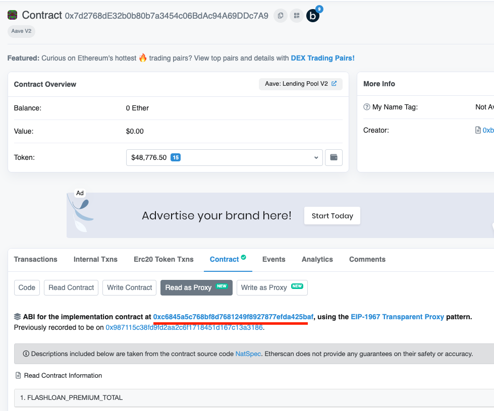
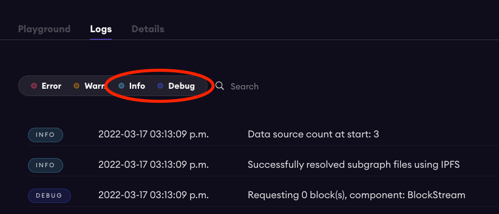

# Mapping

This document contains some information about issues you may run into, or tips and tricks that may help you when working on mappings.

## Best Practices

### Indexing Speed

There are couple things you can do to significantly improve your indexing speed:

- Set a startblock (Use the deployment block of the contracts).
- Avoid call handlers and block handlers. Also depending on the Ethereum node ran by an indexer, call handlers and block handlers may or may not be supported (esp. on alt-EVM chains).
- Limit the number of contract calls you perform. If you do need to perform contract calls, save the data, so you won't have to do repeated calls.

## Common Issues

### Proxy

Some protocols use proxy contracts for upgradeability. Note that when handling proxy contracts, you should use the ABI of the implementation contract instead of the proxy contract. For example, Aave v2 uses a proxy for its Lending Pool contract: https://etherscan.io/address/0x7d2768de32b0b80b7a3454c06bdac94a69ddc7a9#code

You should navigate to the implementation contract first (Contract -> Read as Proxy -> Address underlined in red) and use the ABI there:



### Price Oracles

See [docs/Oracles.md](./Oracles.md)

### Functions with Multiple Return Values

Some functions in a smart contract can have multiple return values. You can bind the contract and make the function call as usual. However, the return values are embedded in `retval.value0` and `retval.value1` etc.

### Failed Transactions

Failed transactions are not indexed by `graph-node` and should not invoke any event handlers or call handlers. However, people have reported issues where they've seen failed transactions before (likely because of an inner call reverted). For example: https://discord.com/channels/438038660412342282/548982456414371850/892721444507774996.

If you run into one of these issues, feel free to let me know and I can report it to The Graph's dev team for investigation.

### Nested Calls

Nested calls (e.g. calls from a multi-sig wallet) still invokes call-handlers and event-handlers regardless of how deep the nesting is.

### Snapshots

If no event occurred throughout the duration of a snapshot, you can skip that snapshot.

## Testing

### Matchstick

You can leverage the Matchstick unit testing framework to better debug/test your code:

https://github.com/LimeChain/matchstick/blob/main/README.md

Keep in mind that the test.ts file no longer needs to wrap all test() method calls into a runTests() function like older documentation specifies. Ensure that you have installed Rust, PostgreSQL, and Docker. If you are experiencing issues building the Dockerfile that is provided by matchstick documentation, confirm that all of the directories in the Dockerfile script are valid. In particular, step 15 attempts to copy the parent directory which is outiside of the build context. For some users, this throws an error and prevents execution. In this case, changing the step 15 to "COPY ./. ." can resolve this and facilitate a successful build. 

## Debugging

### Debug Logs

One of the most useful tools to debug is the `log` function in `@graphprotocol/graph-ts`. You can use it like follows in your mapping code:

```
log.debug('[Test Log] arbitrary argument {}', [123]);
```

which will show up in the Logs tab of Subgraph Studio:



You also have an option of `Error`, `Warning`, `Info`, `Debug` as the log level. I like to use `Warning` so that I can quickly filter for it. The way to filter for logs of a specific level is to click (uncheck) the log levels circled in red above.

**Note**: there is a known issue where historical logs are only kept for an indeterminate amount of time (usually an hour or so). Which means it's difficult to search for historical logs. The workaround is to run `graph-node` locally and deploy your subgraph locally (see instructions below), this way you have access to all your historical logs in the console.

### Indexing Status

You can check the indexing status of your subgraph and surface indexing errors that you may encounter along the way here: https://thegraph.com/docs/en/developer/quick-start/#5-check-your-logs

**Note**: you should use (copy/paste) this endpoint when you use the GraphiQL playground: https://api.thegraph.com/index-node/graphql. If you click into it, it's going to direct you to a different URL which won't work with the GraphiQL playground.

#### Subgraph fails to sync without error message

If you're having issues with the subgraph sync failing and no error messages shown in the log, you can access the **Indexing Status** of your subgraph to get more details. See steps are similar to above:

1. Check your graph health here https://graphiql-online.com/. Where it says "Enter the GraphQL endpoint" copy paste this endpoint https://api.thegraph.com/index-node/graphql
2. After running this, copy the sample query in section 5 of the graph docs here https://thegraph.com/docs/en/developer/quick-start/#5-check-your-logs into the window
3. Replace the part where it says subgraphs: ["Qm..."]  with your deployment id (you will see this in the studio)
4. Run the query, you will see if your subgraph had any indexing errors! 

### Running Locally

You can debug your subgraph by running `graph-node` locally. Here are some instructions to set it up:

https://github.com/graphprotocol/graph-node#running-a-local-graph-node

Note that you need a Ethereum RPC for your `graph-node` to connect to. You can get one for free at [Alchemy](https://www.alchemy.com/) or contact me for one.

### Subgraph Forking

You can avoid re-syncing your subgraph every time by "forking" it from an existing one, which should significantly speed up the iteration time. For more details: https://thegraph.com/docs/en/developer/subgraph-debug-forking/.

## Known Issues

Here are some known issues with subgraph tooling that you may run into:

### Subgraph Issues

- Using a `derivedFrom` field in the graph code gives no compile time issues but fails when the graph syncs with error `unexpected null	wasm` ([Github Issue](https://github.com/graphprotocol/graph-ts/issues/219))
- Event data can be different from contract call data as event data are calculated amid execution of a block whereas contract call data are calculated at the end of a block.
- Note that **call-handlers** are not available on some EVM sidechains (e.g. Avalanche, Harmony, Polygon, etc). So you won't be able to use **call-handlers** in your subgraphs when indexing on these chains.

### AssemblyScript Issues

- When updating an entity array, you cannot use `array.push()` on the entity's field directly. Instead, you need to create a copy of that array. See [details](https://thegraph.com/docs/en/developer/assemblyscript-api/#updating-existing-entities).
- Initialize array using `let a = new Array<T>()` instead of `let a = []`. See [details](https://www.youtube.com/watch?v=1-8AW-lVfrA&t=3174s).
- Scope is not inherited into closures (can't use variables declared outside of a closure). See [details](https://www.youtube.com/watch?v=1-8AW-lVfrA&t=3243s).
