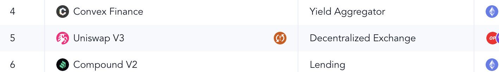

# Production Errors

_Note_: If you are the first to discover the error, please raise it to the team in `#development` on Discord.

It is inevitable that there will be errors in production subgraphs! This document describes how to be the first to catch the errors, and correct them efficiently.

## Catching Errors

There are two types of errors we are concerned about.

1. Fatal errors (the subgraph stops indexing)
2. Data errors (something in the data is now incorrect, e.g. oracle breaks)

### Where to look

Fatal errors will be apparent, if you see an error message in [Protocol Metrics](https://messari.io/protocol-explorer/all-protocols) that looks something like the following:

Data errors will be less obvious and more nuanced. It is possible that there is an error, but we decide not to fix it. For example, in Compound V2 we chose to not fix the ETH price when a proposal they passed broke it. This was what actually happened on chain.

To find these errors, you may notice it by browsing [Protocol Metrics](https://messari.io/protocol-explorer/all-protocols). But it is more likely you will be notified on the Discord [monitor bot](../monitor/README.md).

### How to Setup the Monitor

In order to get notified of production errors (without the noise) follow these steps:

1. Navigate to `#data-validation-bots` in the Subgraphs discord.
2. Mute the channel.
3. Jump into the `Production Ready Subgraph Indexing Failures` thread.
4. Unmute this thread.
5. Congrats! Now you will get notified of production errors here.

## Fixing Errors

> As these subgraphs are in production we want to be efficient and solve the problems swiftly to reduce downtime.

You will need to use your subgraph debugging skills, but here are some tips to help!

- Follow any advice in our [debugging docs](https://github.com/messari/subgraphs/blob/master/docs/Mapping.md#debugging).
- Focus on only solving the issue causing the error.
  - If you find other things (nice job), those can be solved in a separate PR after the error is fixed.
- Log in as many spots as possible to narrow down the issue (generally it will be isolated since the subgraph is QA'd)
- If it is taking more than 2-3 hours of debugging time, it is safe to skip that block (if that fixes it).
  - Use your judgement when it comes to this. And if you do this, please make sure you go back after the fact to continue to try and diagnose the issue.
- Ask questions in our Discord or [The Graph's Discord](https://discord.gg/jxMUPqbAzr)

## Once Solved

Once you have the issue solved, make sure we have it deployed to a Messari production subgraph endpoint.

> Ideally you will want to graft as it is generally faster than indexing from the start.

Once it is fully synced and the issue is fixed:

- Notify a Messarian to backfill the data.
- If you are a Messarian (or have access) please backfill the data, and check to ensure it is fixed ✅

Happy debugging (Don't stress it too much)! 💻
