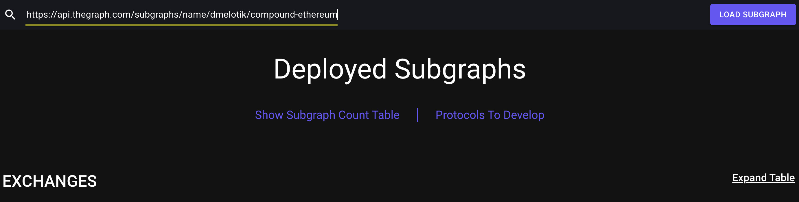
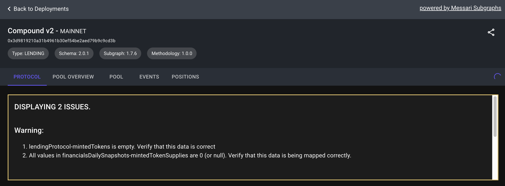
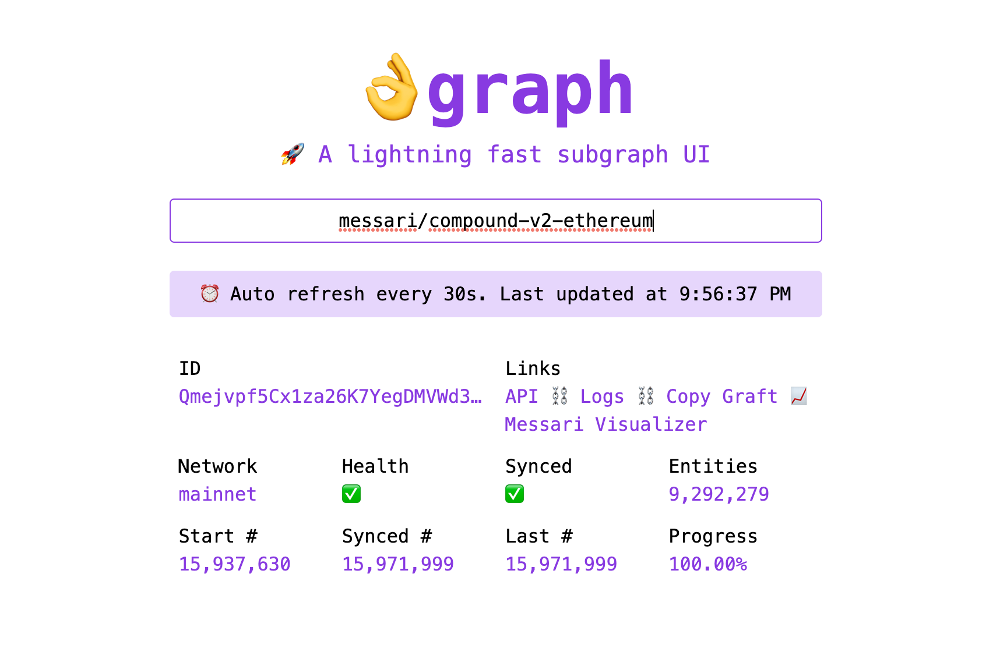

# Tooling

We have a suite of tools that aide subgraph development and usage.

## Messari Subgraph CLI

This one is major, and required for this repo. We talked about the installation in [SETUP.md](./SETUP.md). This CLI is a wrapper that executes the deployment scripts. It can be used by anyone who deploys Messari subgraphs (and requires the directories to be setup how we defined in [STRUCTURE.md](./STRUCTURE.md)).

There is a video describing the use and explains in more details:

## Subgraphs.xyz

This [website](https://subgraphs.messari.io/) is our one stop shop for visualizations. It contains the development/indexing status of all of our subgraphs. Then click into any subgraph and visualize all of the data. This is especially useful for QAing subgraphs and ensuring you are getting the data you expect without any errors.

You can also plug in a subgraph you have deployed to your hosted service and visualize it. Put the "Queries (HTTP)" endpoint in the search bar like this:

The subgraph page will also run a suite of tests outlined [here](../dashboard/README.md) like this:

## okgraph.xyz

This community developed tool allows you to plugin the subgraph id and gives you stats and links on the indexing.

The most used things here are the "Logs", "API", and the "Messari Visualizer". All of these links are imperative for debugging and verifying your subgraphs. If your subgraph fails to index the error will be displayed obviously with the (hopefully) descriptive error message. More on errors in [ERRORS.md](./ERRORS.md).

## Logging Dashboard

This dashboard allows easier viewing of subgraph logs. Without it logs are cleared after ~1 hour. With this tool you can save logs, search through them, and filter.

Here is a [video](https://drive.google.com/file/d/1to7ZRsEcsnsS0DO23oC3W47RUVlsoC2o/view) describing how to use the dashboard.

> If you need any credentials please ask us!

## Miniscan

[Miniscan](https://miniscan.xyz/) is essentially an etherscan wrapper, but it allows for more chains and the ability to make historic contract calls (retrieving state at a specific block number). This tool is especially useful when you are trying to learn about a contract. You would plug in the address and you can view the source code (assuming it is verified) and make contract calls to understand behavior.

## Status Endpoint

This is a public endpoint that allows any user of Messari's subgraph to hit one, trusted source in order to retrieve all information needed to make usage decisions on a subgraph. This can be used at any scale, but has become necessary for us as we have scaled up our subgraphs.

### Request Info

`GET https://api.messari.io/subgraph-status/api/v1/status`

`x-messari-api-key` (header, required): Your Messari API key

> You can find your api key at [messari.io/account/api](https://messari.io/account/api). The only requirement is to have a Messari account, there is no requirement to be a paid customer.

### About The Response

The response is a JSON object with that appends new fields onto the object found in [deployment.json](../deployment/deployment.json). The new fields are:

- `health` this array stores information about the subgraphs indexing health
  - This is useful to decide if you can use a subgraph
  - You can find the deployment ID for all deployments and construct the query endpoint
  - There is also a `version` field that contains the deployed subgraph version. This can be used to make decisions on whether or not that subgraph contains the latest fields. You can refer to our versioning system [here](./CONTRIBUTING.md#naming-and-versioning-conventions)
  - There is visibility on current/pending hosted service, and decentralized network subgraphs
