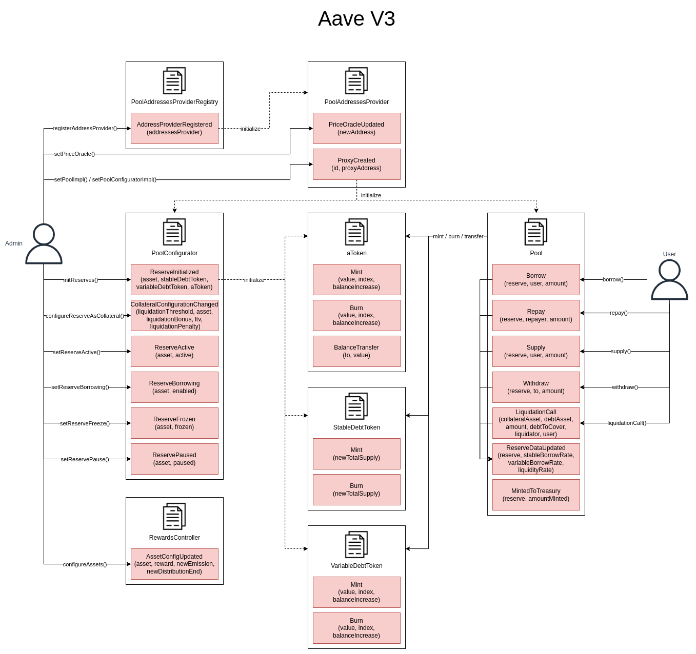

# Aave V3 Subgraph

## Calculation Methodology v1.0.0

### Total Value Locked (TVL) USD

Sum across all Reserves:

`Pool Deposit TVL`

Includes supply interest earned

### Total Revenue USD

Sum across all Reserves:

`Borrow interest + Flash loan premium + Bridge fee + Liquidation bonus`

### Protocol-Side Revenue USD

Portion of the Total Revenue allocated to the Protocol

Sum across all Reserves:

`(Borrow interest * reserve factor) + Flash loan protocol premium + Bridge protocol fee + Liquidation protocol bonus`

Calculated using:

- aToken transfers to treasury address (liquidation bonus)
- `Pool.getReserveData(asset).accruedToTreasury`

### Supply-Side Revenue USD

Portion of the Total Revenue allocated to the Supply-Side

Sum across all Reserves:

`Supply APY + Flash loan LP premium + Bridge LP fee + Liquidation LP bonus`

Calculated using:

- `(aToken liquidity index change * scaled total supply)`
- Liquidate.profitUSD

### Total Borrow Balance

Sum across all Reserves:

`VariableDebtToken total supply + StableDebtToken total supply`

Includes accrued interest

### Total Unique Users

Count of Unique Addresses which have interacted with the protocol via any transaction

`Deposits`

`Withdrawals`

`Borrows`

`Liquidations`

`Repayments`

### Reward Token Emissions Amount

`Emissions per second * seconds per day`

### Protocol Controlled Value

N/A

## References and Useful Links

- Protocol website: https://aave.com
- Protocol documentation: https://docs.aave.com/developers/getting-started/readme
- Smart contracts: https://github.com/aave/aave-v3-core
  - Rewards contracts: https://github.com/aave/aave-v3-periphery
- Deployed addresses: https://docs.aave.com/developers/deployed-contracts/v3-mainnet
- Existing Subgraph: https://github.com/aave/protocol-subgraphs

## Usage

### Prepare

`npm run prepare:yaml --TEMPLATE=aave-v3.template.yaml --PROTOCOL=aave-v3 --NETWORK=matic`

## Smart Contracts Interactions

