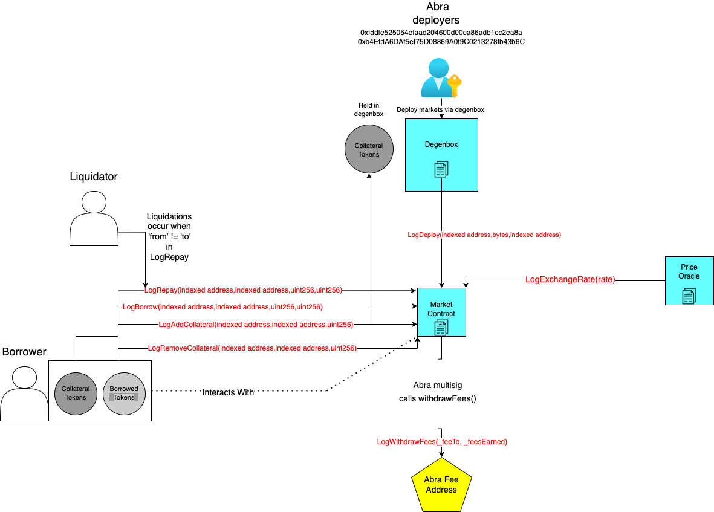

# Abracadabra Lending Protocol Subgraph (Extended)

## Calculation Methodology v1.0.0

### Total Value Locked (TVL) USD

Sum across all Markets:

`Total Collateral Tokens in USD from deposits and withdrawals`

### Total Revenue USD

Sum across all Markets:

`Borrow Opening Fee * MIM Borrwed + Interest Rate * Amount MIM Borrowed + Liquidation Fee * Collateral Liquidated`

### Protocol-Side Revenue USD

Portion of the Total Revenue allocated to the Protocol

`25% of Total Revenue USD is allocated to the Protocol Treasury`

### Supply-Side Revenue USD

Portion of the Total Revenue allocated to the Supply-Side

`75% of Total Revenue USD is awarded backed to Spell Stakers`

### Total Unique Users

Count of Unique Addresses which have interacted with the protocol via any transaction

`Borrows`

`Repays`

`Deposits`

`Withdraws`

`Liquidations`

`Staking`

### Total Volume USD

Sum across all Markets:

`Amount of Borrows and Repays`

### Input Token Balances

Amount of collateral for each Market

`Sum of Deposits and Withdrawals`

### Output Token Supply

Amount of MIM tokens minted for each Market

`Sum of Borrows minus Repays`

### NO Reward Token Emissions

## Notes

- To get price in a vault we can use the following logic.
  - price = `1` / (`exchangeRate` / `1etoken.decimals`)
  - Also keeping `LogExchangeRate` in order to serve prices to markets where the above methods don't work.
- The v2/v3 markets have an oracle with a function called `peekSpot`. Calling this with "0x0" will return the current spot price.
  - We loop through this on every event as a backup to ensure that the market prices are up to date.
- `stkcvxcrv3crypto-abra` does not have any token decimals, however the prices are based off an 18 decimal point system. To account for this we will override the ERC20 contract call and force the decimals to be 18.
- According to the Abracadabra team, their analytics page is "out of date" (https://discord.com/channels/847767926286319646/980148053518475274/1009048171785228369)
- Fees displayed on the analytic page is based off of outstanding loans.
  - Fees are not realized until a position is closed and `LogAccrue` is emitted with a non 0 value.
- On the JoeBar market in Avalanche there is a pricing mishap at the beginning of the market's life. To fix it we need to offset the rate by 6 instead of 18.

## References and Useful Links

- Protocol: https://abracadabra.money/
- Analytics: http://dashboard.abracadabra.money/
- Docs: https://wizard69.gitbook.io/abracadabra-money/
- Smart contracts: https://github.com/Abracadabra-money/bentobox-strategies
- Deployed addresses: https://docs.abracadabra.money/our-ecosystem/our-contracts

## Smart Contracts Interactions



## Build

- Initialize subgraph (Subgraph Studio):
  ```
  graph init --product subgraph-studio
  --from-contract <CONTRACT_ADDRESS> [--network <ETHEREUM_NETWORK>] [--abi <FILE>] <SUBGRAPH_SLUG> [<DIRECTORY>]
  ```
- Initialize subgraph (Hosted Service):
  ```
  graph init --product hosted-service --from-contract <CONTRACT_ADDRESS> <GITHUB_USER>/<SUBGRAPH_NAME>[<DIRECTORY>]
  ```
- Generate code from manifest and schema: `graph codegen`
- Build subgraph: `graph build`

## Deploy

- Authenticate (just once): `graph auth --product hosted-service <ACCESS_TOKEN>`
- Deploy to Subgraph Studio: `graph deploy --studio <SUBGRAPH_NAME>`
- Deploy to Hosted Service: `graph deploy --product hosted-service <GITHUB_USER>/<SUBGRAPH_NAME>`
