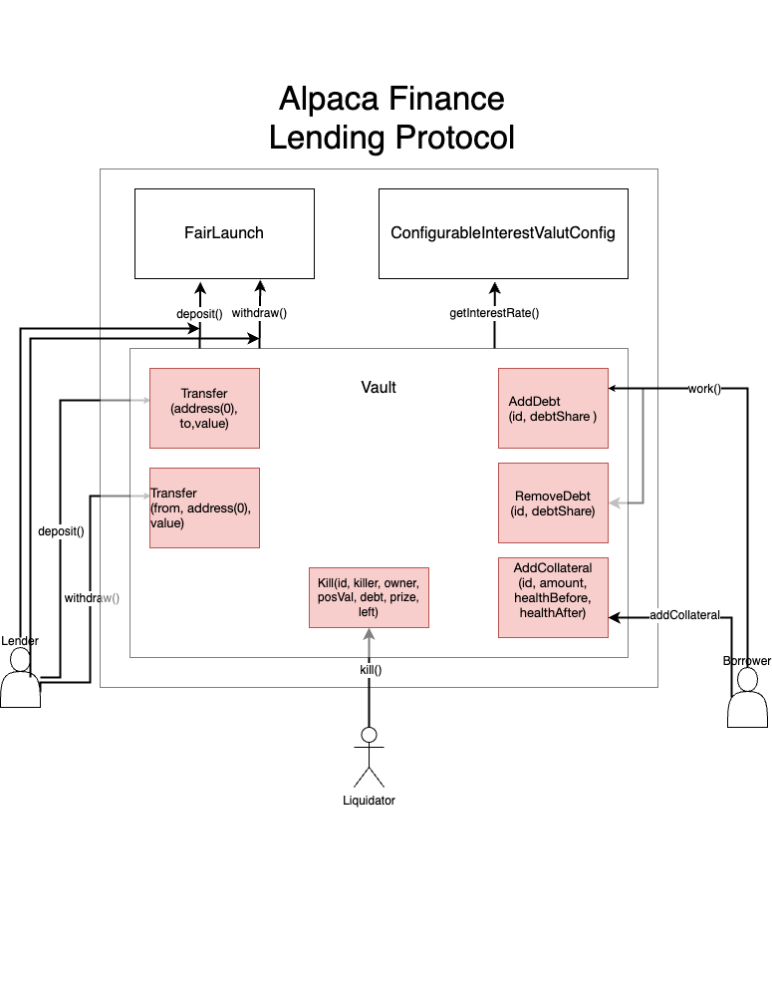

# Alpaca Finance Lending Protocol Subgraph

## Calculation Methodology v1.0.0

Alpaca Finance is a leading lending protocol allowing leveraged yield farming on BNB Chain. It helps lenders earn safe and stable yields, and offers borrowers undercollateralized loans for leveraged yield farming positions, vastly multiplying their farming principals and resulting profits.‌

### Total Value Locked (TVL) USD

Sum across all Reserves:

`Lending Pools total TVL`

It does not include the market value of interest bearing tokens which are generated from the lending pools and locked in the protocol's staking contract.

### Protocol-Side Revenue USD

Portion of the Total Revenue allocated to the Protocol

Sum across all lending pools:

`Loans' interest amount * protocol's fee percentage + Liquidation protocol bonus`

### Total Borrow Balance

Sum across all lending pools:

`Pool's outstanding loans value`

It does not includes accrued interest.

### Total Unique Users

Count of Unique Addresses which have interacted with the protocol via any transaction

`Deposits`

`Withdrawals`

`Borrows`

`Repayments`

`Liquidations`

### Reward Token Emissions Amount

`Emissions per second * seconds per day`

## References and Useful Links

- Protocol website: https://alpacafinance.org/
- Protocol documentation: https://https://docs.alpacafinance.org/
- Smart contracts: https://https://github.com/alpaca-finance/bsc-alpaca-contract
  - Lending protocol: https://github.com/alpaca-finance/bsc-alpaca-contract/tree/main/solidity/contracts/6/protocol
  - Deployed addresses: https://github.com/alpaca-finance/bsc-alpaca-contract/blob/main/.mainnet.json
  - Documentations: https://alpaca-doc.s3.ap-southeast-1.amazonaws.com/lyf/Export-3aa4ff3c-20f2-4868-95ee-96a4da364889/Contract+Documentation+4c48a0c0db7442c6aa0268dd110e6b80.html

## Usage

### Prepare

`npm run prepare:yaml --TEMPLATE=alpaca.finance.lending.template.yaml --PROTOCOL=alpaca-finance-lending --NETWORK=bsc`

## Smart Contracts Interactions

