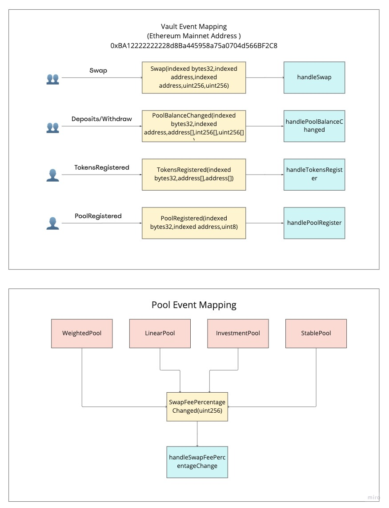

# Balancer v2 Subgraph

## Calculation Methodology v1.0.0

### Total Value Locked (TVL) USD

Sum across all Pools:

`Liquidity Pool TVL`

### Total Revenue USD

Sum across all Pools:

`Pool Swap Volume * Pool Swap Fee`

Note, does this not include

- Flash Loans (Flash Loan Amount \* Flash Loan Interest)
- Asset Manager Yield Generated

### Protocol-Side Revenue USD

Portion of the Total Revenue allocated to the Protocol

Sum across all Pools:

`Pool Swap Volume * Pool Swap Fee * ProtocolSide Fee`

### Supply-Side Revenue USD

Portion of the Total Revenue allocated to the Supply-Side

Sum across all Pools

`Pool Swap Volume * Pool Swap Fee * (1 - ProtocolSide Fee)`

### Total Unique Users

Count of Unique Addresses which have interacted with the protocol via any transaction

`Swaps`

`Deposits`

`Withdraws`

### Reward Token Emissions Amount
Note: Currently, 145,000 BAL tokens, or approximately 7.5M per year, are distributed every week through the Liquidity Mining program.

### Protocol Controlled Value

To be added

## Useful Links

- Protocol: https://balancer.fi/
- Analytics: https://dune.xyz/balancerlabs
- Docs: https://docs.balancer.fi/
- Smart contracts: https://github.com/balancer-labs/balancer-v2-monorepo
- Deployed addresses: https://github.com/balancer-labs/balancer-v2-monorepo/tree/master/pkg/deployments#past-deployments
- Official subgraph: https://github.com/balancer-labs/balancer-subgraph-v2

## Smart Contracts Interactions

## Build

- Generate code from manifest and schema: `yarn codegen`
- Build subgraph:
  - Mainnet: `yarn build:mainnet`
  - Polygon: `yarn build:polygon`
  - Arbitrum: `yarn build:arbitrum`
  - Beets: `yarn build:beets`
  - Beets-optimism: `yarn build:beetsop`

## Deploy

- Authenticate (just once): `graph auth --product hosted-service <ACCESS_TOKEN>`
- Deploy to Hosted Service:
  - Mainnet `yarn deploy:mainnet`
  - Polygon `yarn deploy:polygon`
  - Arbitrum `yarn deploy:arbitrum`
  - Beets: `yarn deploy:beets`
  - Beets-optimism: `yarn deploy:beetsop`
