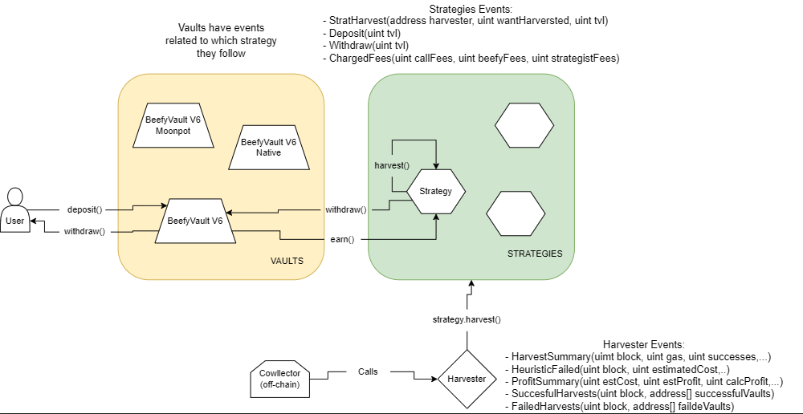

# Beefy Finance - Yield Protocol Subgraph

## Calculation Methodology v1.0.0

### Total Value Locked (TVL) USD

Sum across all Vaults:

`vault.totalValueLockedUSD`

### Total Unique Users

Count of Unique Addresses which have interacted with the protocol via any transaction

`Deposits`

`Withdrawals`

### Deposits

Since deposit event has only the `tvl` parameter, deposited amount is calculated by subtracting the last tvl registered by the subgraph to the current input token balance

`Deposit.amount = event.params.tvl - vault.inputTokenBalance`

### Whitdraws

Since withdraw event has only the `tvl` parameter, whitdrawn amount is calculated by subtracting the current input token balance to the last tvl registered by the subgraph

`Withdraw.amount = vault.inputTokenBalance - event.params.tvl`

### Harvests and Supply-Side Revenue

Harvest events for the various vaults can be divided into two categories: events that return the amount harvested and events that don't. In the case amount harvested is not returned, we use the difference between current tvl and last stored tvl instead.

`amountHarvested = contract.balance() - vault.inputTokenBalance`

Supply-side revenue is then obtained by summing all the amount harvested (since fees to the protocol are paid separately)

`protocol.cumulativeSupplySideRevenueUSD += amountHarvested * inputToken.lastPriceUSD`

### Charged Fees and Protocol-Side Revenue

Protocol fees are applied by `chargeFees()` function and paid in wrapped native token.

`protocol.cumulativeSupplyProtocolRevenueUSD += (event.params.beefyFees + event.params.strategistFees + event.params.callFees) * nativeToken.lastPriceUSD`

### Total Revenue USD

`protocol.cumulativeTotalRevenueUSD = protocol.cumulativeSupplySideRevenueUSD + protocol.cumulativeSupplyProtocolRevenueUSD`

## Useful Links and references

- https://beefy.finance/
- https://app.beefy.com/#/
- https://docs.beefy.com/
- https://dashboard.beefy.finance/
- https://api.beefy.finance/
- https://defillama.com/protocol/beefy-finance

## Deploying

Before deploying, run

`yarn write-yaml ${network}`

to build the yaml file for the correct chain; than you can deploy using

`yarn deploy ${githubuser/subgraphname}`

### Using the Makefile

Simply run `make network=bsc deployment=messari/beefy-finance-bsc` for example

## Known Issues

- Beefy Finance `harmony` has no vaults yet
- On Celo, sushiswap oracle fails to fetch prices of LP tokens
- Since the workaround to calculate deposit and withdraws amounts is not perfect (if more calls to the same vault are done in the same block there could be interferences between events) some negative amounts could occasionally come up
- Some vaults do not emit all the needed events for a complete tracking of all the metrics, so some old data may be missing
