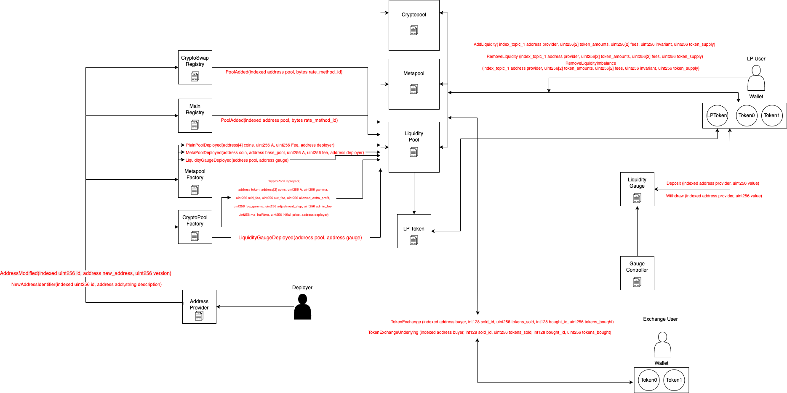

# Curve Subgraph

## Calculation Methodology v1.0.0

### Total Value Locked (TVL) USD

Sum across all Pools:

`Coin balances`

### Total Revenue USD

Sum across all Pools:

`(Swap Trading Volume * Pool Swap Fee)`

Note: The Pool Swap Fee + Pool Admin Fees can be dynamically updated from pool-to-pool

### Protocol-Side Revenue USD

Portion of the Total Revenue allocated to the Protocol

Sum across all Pools:

`(Swap Trading Volume * Pool Swap Fee * Pool Admin Fee)`

Note: The Pool Swap Fee + Pool Admin Fees can be dynamically updated from pool-to-pool

### Supply-Side Revenue USD

Portion of the Total Revenue allocated to the Supply-Side

Sum across all Pools

`(Swap Trading Volume * Pool Swap Fee * (1 - Pool Admin Fee))`

Note: The Pool Swap Fee + Pool Admin Fees can be dynamically updated from pool-to-pool

### Total Unique Users

Count of Unique Addresses which have interacted with the protocol via any transaction

`Swaps`

`Deposits`

`Withdraws`

### Reward Token Emissions Amount

Rewards are measure in emissions per day. All pools with a Gauge Contract earn CRV as reward token.

Curve Rewards:
`Curve inflation rate per second * gauge relative weight * seconds in a day`

Extra Rewards:
`Reward token emissions rate per second * seconds in a day`

## References and Useful Links

- Protocol: https://curve.fi/
- Analytics: https://dune.com/mrblock_buidl/Curve.fi
- Docs: https://curve.readthedocs.io/
- Smart contracts: https://github.com/curvefi/curve-contract
- Deployed addresses: https://curve.readthedocs.io/ref-addresses.html
- Other Existing subgraph: https://thegraph.com/hosted-service/subgraph/curvefi/curve

## Additonal Notes

- Curve gauge rewards are technically allocated for pools across all chains that Curve is deployed on. Unfortunately, this allocation data based on pool type is only available on ethereum mainnet. Gauge rewards data for Curve on alternate chains will need to be manually integrated at another stage of the data ETL pipeline.

- Some withdraw events do not have the amount of pool input tokens removed, as it is impossible to get that information without access to transaction trace

## Smart Contracts Interactions



## Build

- Initialize subgraph (Subgraph Studio):
  ```
  graph init --product subgraph-studio
  --from-contract <CONTRACT_ADDRESS> [--network <ETHEREUM_NETWORK>] [--abi <FILE>] <SUBGRAPH_SLUG> [<DIRECTORY>]
  ```
- Initialize subgraph (Hosted Service):
  ```
  graph init --product hosted-service --from-contract <CONTRACT_ADDRESS> <GITHUB_USER>/<SUBGRAPH_NAME>[<DIRECTORY>]
  ```
- Generate code from manifest and schema: `graph codegen`
- Build subgraph: `graph build`

## Deploy

- Authenticate (just once): `graph auth --product hosted-service <ACCESS_TOKEN>`
- Deploy to Subgraph Studio: `graph deploy --studio <SUBGRAPH_NAME>`
- Deploy to Hosted Service: `graph deploy --product hosted-service <GITHUB_USER>/<SUBGRAPH_NAME>`
