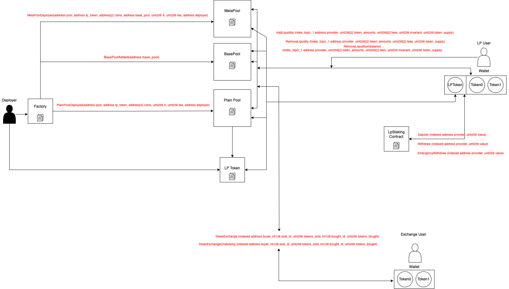

# Ellipsis Finance (DEX) Subgraph

## Calculation Methodology v1.0.0

### Total Value Locked (TVL) USD

Sum across all Pools:

`Coin balances`

### Total Revenue USD

`(Swap Trading Volume * Pool Swap Fee)`

Note: The Pool Swap Fee + Pool Admin Fees can be dynamically updated from pool-to-pool
### Protocol-Side Revenue USD

Portion of the Total Revenue allocated to the Protocol

Sum across all Pools:

`(Swap Trading Volume * Pool Swap Fee * Pool Admin Fee)`

Note: The Pool Swap Fee + Pool Admin Fees can be dynamically updated from pool-to-pool

### Supply-Side Revenue USD

Portion of the Total Revenue allocated to the Supply-Side

Sum across all Pools

`(Swap Trading Volume * Pool Swap Fee * (1 - Pool Admin Fee))`

Note: The Pool Swap Fee + Pool Admin Fees can be dynamically updated from pool-to-pool

### Total Unique Users

Count of Unique Addresses which have interacted with the protocol via any transaction

`Swaps`

`Deposits`

`Withdraws`

### Reward Token Emissions Amount

Staking Rewards: 
 
`V1 = EPS inflation rate per second * pool relative weight`

`V2 = EPX inflation rate per second * pool relative weight`

## References and Useful Links

- Protocol: https://ellipsis.finance/
- Analytics: https://defillama.com/protocol/ellipsis-finance
- Docs: https://docs.ellipsis.finance/ellipsis-2.0/a-new-ellipsis
- Smart contracts: https://github.com/ellipsis-finance/ellipsis-v2
- Deployed addresses: https://docs.ellipsis.finance/ellipsis-2.0/deployment-links

## Smart Contracts Interactions



## Build

- Initialize subgraph (Subgraph Studio):
  ```
  graph init --product subgraph-studio
  --from-contract <CONTRACT_ADDRESS> [--network <ETHEREUM_NETWORK>] [--abi <FILE>] <SUBGRAPH_SLUG> [<DIRECTORY>]
  ```
- Initialize subgraph (Hosted Service):
  ```
  graph init --product hosted-service --from-contract <CONTRACT_ADDRESS> <GITHUB_USER>/<SUBGRAPH_NAME>[<DIRECTORY>]
  ```
- Generate code from manifest and schema: `graph codegen`
- Build subgraph: `graph build`

## Deploy

- Authenticate (just once): `graph auth --product hosted-service <ACCESS_TOKEN>`
- Deploy to Subgraph Studio: `graph deploy --studio <SUBGRAPH_NAME>`
- Deploy to Hosted Service: `graph deploy --product hosted-service <GITHUB_USER>/<SUBGRAPH_NAME>`