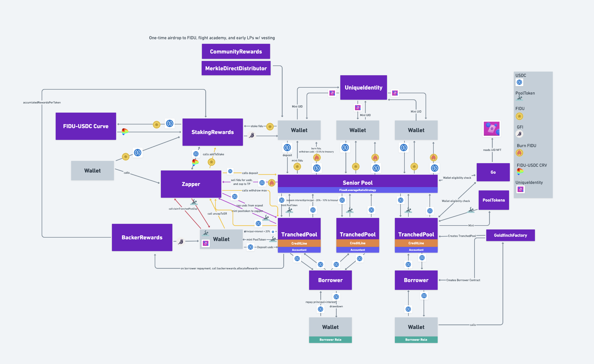

# Goldfinch Lending Protocol Subgraph

## Calculation Methodology v1.0.0

There are two types of markets (pools): Tranched Pool and Callable Loan. Both are created by the GoldfinchFactory contract, with `PoolCreated` and `CallableLoanCreated` event, respectively.

### Total Value Locked (TVL) USD

Sum across all Markets (Pools):

`Total deposit amount USD - total withdrawal amount USD`

Note: Investments made to Tranched Pools from the Senior Pool are deducted from Protocol TVL to avoid double counting.

### Total Deposit USD

Sum across all Markets:

`Total deposit amount USD - total withdrawal amount USD`

Note: Investments made to Tranched Pools from the Senior Pool are deducted from Protocol Total Deposit to avoid double counting.

### Total Borrow USD

Sum across all markets:

`Draw down amount USD`

### Total Revenue USD

Sum across all Markets:

`Protocol-Side revenue + Supply-Side revenue`

### Protocol-Side Revenue USD

Sum across all Markets:

Reserve Fund Collected, i.e., `ReserveFundCollected.params.amount`

### Supply-Side Revenue USD

Sum across all Markets

`PaymentApplied.InterestAmount`

Note: Goldfinch collects protocol side revenue from 3 sources: 1.) withdraw fee from senior pool; 2.) a portion of interest received from extra senior pool deposit swept to Compound; 3.) a portion of interest payment made by tranched pool borrowers. All three emits ReserveFundCollected event and thus are accounted in Protocol-Side Revenue method above. While protocol side revenue from tranched pool borrowing interest (source 3) is a fixed ratio (10% of total interest payment as of December 2022) to supply side revenue (90% of total interest payment), other sources of protocol side revenue do not maintain the split.

### Total Unique Users

Count of Unique Addresses which have interacted with the protocol via any transaction

### Reward Token Emissions

The reward token is GFI. There are two types of reward emissions : backer rewards and staking rewards, each managed by its own contract.

- Staking Rewards (StakingRewards.sol): `event RewardPaid.params.reward`
- Backer Rewards (BackerRewards.sol): sum over all claims by markets `BackerRewardsClaimed.params.amountOfTranchedPoolRewards + BackerRewardsClaimed.params.amountOfSeniorPoolRewards`

### Minted Token Supply (None)

## References and Useful Links

- Protocol: https://goldfinch.finance/
- Analytics: https://api.thegraph.com/subgraphs/name/goldfinch-eng/goldfinch/graphql
- Docs: https://docs.goldfinch.finance/goldfinch/
- Smart contracts: https://github.com/goldfinch-eng/mono/tree/main/packages/protocol/contracts
- Deployed addresses: https://github.com/goldfinch-eng/mono/tree/main/packages/protocol/deployments/mainnet

## Smart Contracts Interactions

# The Official Goldfinch Subgraph

Part of the Goldfinch subgraph was built on the official Goldfinch subgraph. The code for the official Goldfinch subgraph is at https://github.com/goldfinch-eng/mono/tree/main/packages/subgraph (document of the official subgraph can be found there) and a deployed version is at https://thegraph.com/hosted-service/subgraph/goldfinch-eng/goldfinch-v2
