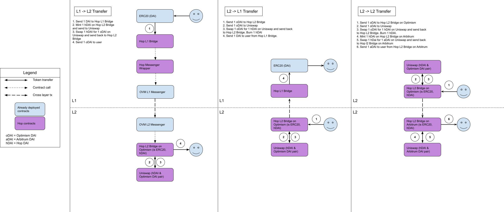

# Hop Protocol

Hop is a scalable rollup-to-rollup general token bridge. It allows users to send tokens from one rollup or sidechain to another almost immediately without having to wait for the networks challenge period.

## Usage metrics

`Unique Transfer Senders` & `Unique Transfer Receivers`

Number of users that have either sent or received tokens or ETH through the bridge.

`Unique Message Senders`

Number of users that have sent messages through the bridge. Note that a messages sent during bridge transfers are excluded.

`Active Users` & `Total Unique Users`

Number of users that have interacted with the protocol in any way - transferring tokens/ETH or sending messages.

## Volume

### `Volume Out USD`

Sum of assets transferred out from selected network.

### `Volume In USD`

Sum of assets transferred in to selected network.

### `Total Volume USD`

`Volume Out USD` + `Volume In USD`

### `Net Volume USD`

`Volume In USD` - `Volume Out USD`

## Total Value Locked USD

Total value of assets currently locked in the Amm.

## Revenue

Hop Protocol takes a fee for swaps on L2 which goes to the liquidity providers. The fee is 4 basis points or 0.04% of the swap amount.

## Notes

- Received messages are not being tracked, because there is not enough data included in the event.

## Smart Contract Interactions

## Links

Links to the relevant sources to learn about this protocol.

- Protocol: https://app.hop.exchange/
- Docs: https://docs.hop.exchange/v/developer-docs/
- Smart contracts: https://github.com/hop-protocol/contracts
- Smart contract addresses: https://docs.hop.exchange/v/developer-docs/smart-contracts/contract-addresses
