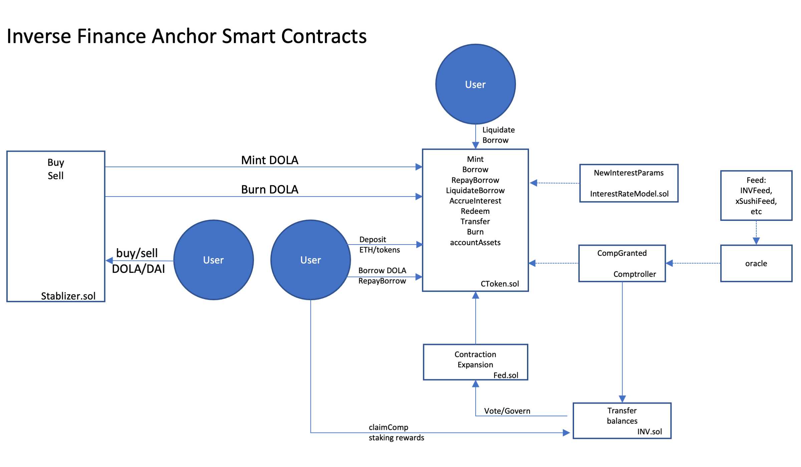

# Inverse Finance Lending Protocol Subgraph

## Calculation Methodology v1.0.0

### Total Value Locked (TVL) USD

Sum across all Markets:

`Sum of Deposits on Anchor`

`= CToken.get_cash() * priceOracle.getUnderlyingPrice(CToken)`

`CToken.get_cash()` returns the deposits (inputTokenBalance), which is then converted to USD by
multiplying with the underlying token price (including ETH) returned from the price Oracle contract.

### Total Revenue USD

Sum across all Markets:

`Sum of Interest paid by borrowers + Fees earned by Stabilizer`

`= AccrueInterest.interestAccumulated * priceOracle.getUnderlyingPrice(CToken) + Buy/Sell fees on Stablizer`

The `AccrueInterest` event is emitted when interest (revenue) is accrued in the underlying token. The interest (revenue) is converted to USD by multiplying with the underlying token price (including ETH) returned from the price Oracle contract.

Currenltly borrowing is paused after an exploit. Stabilizer is a backstop for DOLA peg that takes 0.4% for buying and 0.1% for selling DOLA.

### Protocol-Side Revenue USD

Portion of the Total Revenue allocated to the Protocol. The total interest (revenue) is split between depositors (supply-side) and the protocol based on the value of the `reserveFactor`.

Sum across all Markets:

`(Sum of Interest paid by borrowers) * Protocol Share + Fees earned by Stabilizer`

`= total revenue * reserveFactorMantissa / 10 ^ MANTISSA + Buy/Sell fees on Stablizer`

### Supply-Side Revenue USD

Portion of the Total Revenue allocated to the Supply-Side. The total interest (revenue) is split between depositors (supply-side) and the protocol based on the value of the `reserveFactor`.

Sum across all Markets:

`Sum of Interest paid by borrowers * (1 - Protocol Share)`

`= Total Revenue USD - Protocol-Side Revenue USD`

### Total Unique Users

Count of Unique Addresses which have interacted with the protocol via any transaction

`Deposits`

`Withdrawals`

`Borrows`

`Repays`

`Liquidations`

### Reward Token Emissions Amount

The inverse-finance comptroller computes the rewards emissions to lenders and borrowers when users interacts with the contracts, and emit `DistributedSupplierComp` and `DistributedBorrowerComp` event when emissions are rewarded. The event paramater `compDelta` contains the amount of emissions. Since the emissions happen irregularly, to normalize the emssions to a daily amount, a HelperStore entity keeps tract the block number of the last emissions, and is used to computed `deltaBlocks` between two emissions. The normalized daily emissions = `compDelta / deltaBlock * BLOCKS_PER_DAY`.

Reward emissions for lenders: `DistributedSupplierComp.compDelta * priceOracle.getUnderlyingPrice(CToken) * BLOCKS_PER_DAY / deltaBlocks`

Reward emissions for borrowers: `DistributedBorrowerComp.compDelta * priceOracle.getUnderlyingPrice(CToken) * BLOCKS_PER_DAY / deltaBlocks`

### Protocol Controlled Value

Not applicable.

## Links

- Protocol: https://www.inverse.finance/
- Analytics: https://dune.xyz/naoufel/inverse-dao
- Docs: https://docs.inverse.finance/inverse-finance/about-inverse
- Smart contracts: https://github.com/InverseFinance/anchor
- Deployed addresses: https://docs.inverse.finance/inverse-finance/technical/smart-contracts
- Official subgraph: https://thegraph.com/studio/subgraph/inverse-subgraph/

## Build

- Initialize subgraph (Subgraph Studio):
  ```
  graph init --product subgraph-studio
  --from-contract <CONTRACT_ADDRESS> [--network <ETHEREUM_NETWORK>] [--abi <FILE>] <SUBGRAPH_SLUG> [<DIRECTORY>]
  ```
- Initialize subgraph (Hosted Service):
  ```
  graph init --product hosted-service --from-contract <CONTRACT_ADDRESS> <GITHUB_USER>/<SUBGRAPH_NAME>[<DIRECTORY>]
  ```
- Generate code from manifest and schema: `graph codegen`
- Build subgraph: `graph build`

## Deploy

- Authenticate (just once): `graph auth --product hosted-service <ACCESS_TOKEN>`
- Deploy to Subgraph Studio: `graph deploy --studio <SUBGRAPH_NAME>`
- Deploy to Hosted Service: `graph deploy --product hosted-service <GITHUB_USER>/<SUBGRAPH_NAME>`

## Hosted Subgraph

- Hosted subgraph: https://thegraph.com/hosted-service/subgraph/tnkrxyz/inverse-finance

## Smart Contracts Interactions



## Inverse Finance Lending Protocol

## Deposit, Borrow, and Liquidate in Markets

The Inverse Finance Lending Protocol is controled by a [comptroller contract](https://etherscan.io/address/0x4dCf7407AE5C07f8681e1659f626E114A7667339), which controls 11 markets represented by an Anchor ERC20 token with a corresponding underlying/input token, including anDOLA/DOLA, anETH/ETH, anWBTC/WBTC, anxShushi/xSushi, anYFI/YFI, xINV/INV (an old and new contract), anStETH/stETH, anDOLA3POOL-CRV/DOLA3POOL CRV LP Token, anINV-DOLA SLP/INV-DOLA Sushi LP Token, and anFLOKI/FLOKI (deprecated). When a user deposits underlying (input) tokens in a market, they mint the corresponding Anchor token. As a depositor, the user will receive interest and INV token emissions as reward. An depositor can also borrow underlying tokens from any of the markets. The ratio between total borrow amount and collateral amount across all markets must be below a specified collateral factor. If a borrower's loan-to-collateral ratio is above the collateral factor, a liquidator can invoke the `LiquidateBorrow` function, repay all or part of the borrower's debt, and seize the borrower's Anchor tokens (which can then be redeemed for the underlying token).

## DOLA stablecoin and the Fed

The Inverse DAO also manages the DOLA stablecoin. The DOLA's peg to \$1 is maintained through [the Fed contract](https://etherscan.io/address/0x5e075e40d01c82b6bf0b0ecdb4eb1d6984357ef7) and through [the stablizer](https://etherscan.io/address/0x7ec0d931affba01b77711c2cd07c76b970795cdd), an exhange allowing users to arbitrage the differential between DAI and DOLA by swapping between them. When the demand for DOLA is high (price is above \$1), the Fed contract expands (increases) the DOLA supply by minting more DOLA and anDOLA tokens; vice versa, it contracts (reduces) the DOLA supply by burning the DOLA and anDOLA tokens. During expansion, the Fed contract is the supplier of liquidity in the anDOLA/DOLA market and earns a profit (interest) from its deposit.

Besides the Anchor Fed, separate Fed contracts also supplies DOLA to the lending pools of serval lending partners, including Yearn, Bagder, 0xb1, Fuse, and Scream (Fantom). The Fed contract behaves similar to Anchor Fed, with customization to make it work with the contract of each lending partner.
