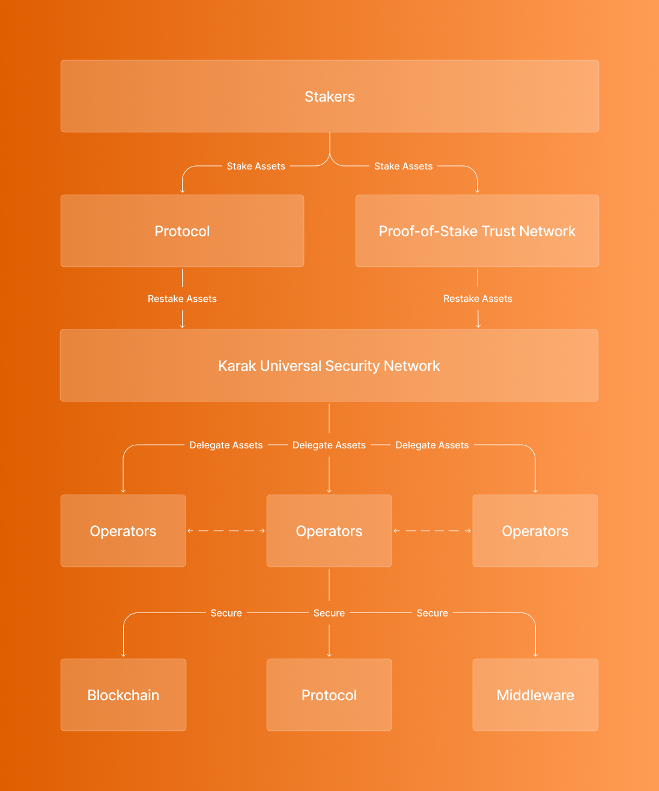

# Karak Subgraph

## Methodology v1.0.0

Karak operates as a marketplace where,

- users repurpose their staked assets to extend Ethereum as well as other trust networks' security to other applications
- developers get to incentivize validators to allocate their restaked assets to secure their secured services instead of issuing their own highly inflationary tokens as rewards for validators and having to establish a new trust network from the ground up

Karak introduces multiasset restaking, a new primitive in cryptoeconomic security allowing users to restake assets such as ethereum, liquid staking tokens, stablecoins, and more preventing a single asset's failure and to earn rewards.

## Metrics

### Usage and Transactions

- Deposits into ERC4626 vault to restake
- Withdrawals from the vault to unstake (there is a delay of 7 days since requesting withdrawal to receiving)

### TVL

Total assets in all of Karak's vaults.

### Fees and Revenue

The protocol does not charge a fee or generate any revenue at the moment.

## Useful Links

- Landing Page: https://karak.network/
- Staking App: https://app.karak.network/
- Docs: https://docs.karak.network/karak
- Contracts: https://docs.karak.network/karak/developers/contract-addresses
