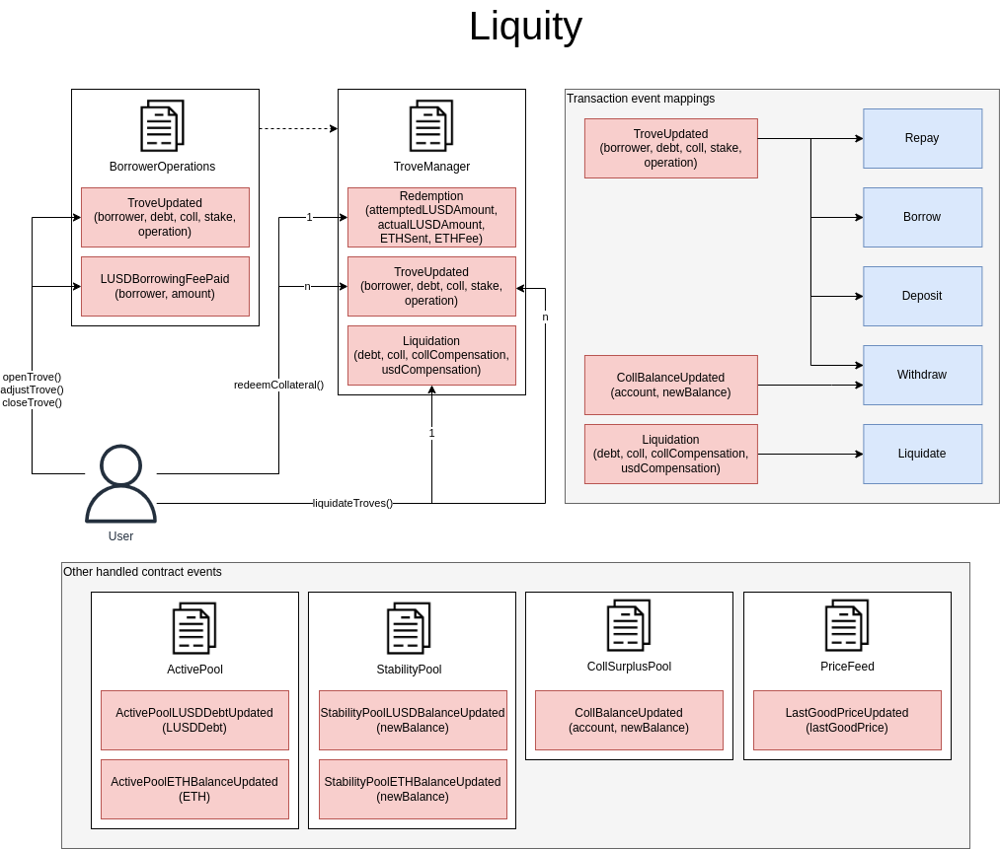

# Liquity Lending Protocol Subgraph

## Links

- Protocol website: https://www.liquity.org
- Protocol documentation: https://docs.liquity.org
- Smart contracts: https://github.com/liquity/dev/tree/main/packages/contracts/contracts
- Deployed addresses: https://docs.liquity.org/documentation/resources#contract-addresses
- Existing subgraphs: https://thegraph.com/explorer/subgraph?id=2TmD7Fq3K2BQGmUXNPzrNMXb6PDNbcBWfAHa5o3gRJC8

## Calculation Methodology v1.0.1

### Total Value Locked (TVL) USD

Sum across all Pools:

`Collateral locked in Troves + LUSD and Collateral in stability pool`

Ignores LQTY staked. Currently, the only Collateral is ETH.

### Total Revenue USD

Sum across all Pools:

`Borrowing Fee + Redemption Fee + Liquidation Revenue (i.e. Liquidation reserve of 200 LUSD + Value of Collateral - Outstanding Loan Amount)`

Borrowing fee is 0.5% to 5% depending on amount borrowed, Redemption fee is Borrowing fee + 0.5%

### Protocol-Side Revenue USD

Portion of the Total Revenue allocated to the Protocol

Sum across all Pools:

`Borrowing Fee + Redemption Fee + Part of Liquidation Revenue (Liquidation reserve of 200 LUSD + 0.5% of Collateral)`

Part of Liquidation Revenue (Liquidation reserve of 200 LUSD + 0.5% of Collateral) goes to Liquidator

### Supply-Side Revenue USD

Portion of the Total Revenue allocated to the Supply-Side

Sum across all Pools

`Part of Liquidation Revenue (i.e. 99.5% of Collateral - Outstanding Loan Amount)`

### Total Unique Users

Count of Unique Addresses which have interacted with the protocol via any transaction

`Deposits`

`Withdrawals`

`Borrows`

`Repays`

`Liquidations`

### Reward Token Emissions Amount

To be added

### Protocol Controlled Value

To be added

## Smart Contract Interactions

### Events included in the subgraph

See also official documentation for more detailed charts:

https://github.com/liquity/dev#flow-of-ether-in-liquity
