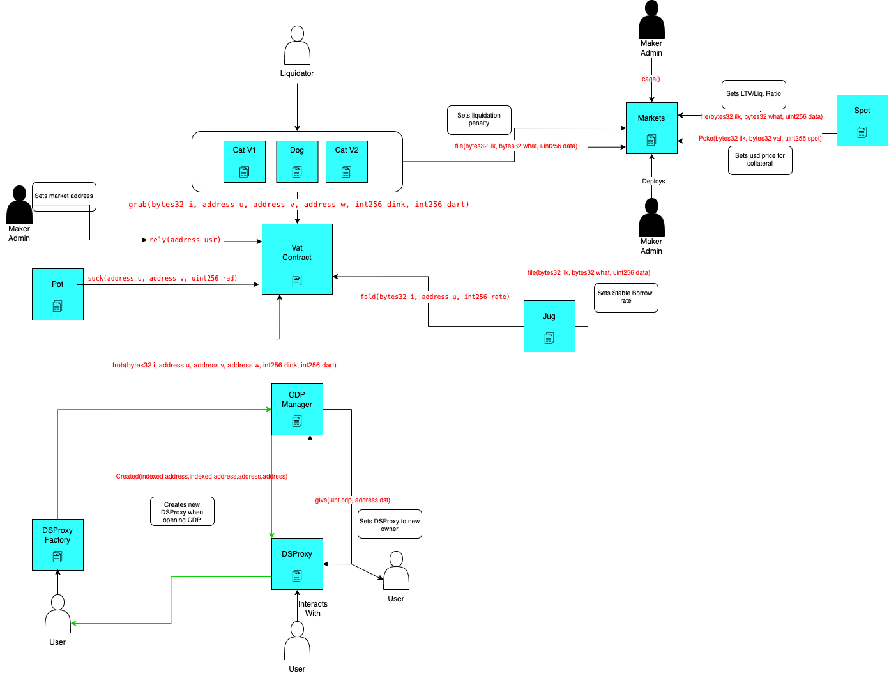

# MakerDAO Lending Protocol Subgraph

## Calculation Methodology v1.0.0

### Total Value Locked (TVL) USD

Sum across all Markets:

`Total Collateral Tokens in USD after accounting deposits and withdrawals`

Total collateral is counted by dink during frob events

### Total Deposit USD

Sum across all Markets:

`Sum dink values emitted during Frob events from Vat address per Market`

'ink' is considered the market's collateral, dink stands for Δink, contract emits signed values

### Total Borrow USD

Sum across all Markets:

`Sum dart values emitted during Frob events from Vat address per Market`

'art' is considered the market's debt, dart stands for Δart, contract emits signed values

### Total Revenue USD

Sum across all Markets:

`(Change in market debt multiplier rate value from Vat Fold event * market total borrow usd) + (Liquidations per market * liquidation penalty per market)`

### Protocol-Side Revenue USD

### Protocol-Side Revenue USD

Sum across all Markets:

`(Change in market debt multiplier rate value from Vat Fold event * market total borrow usd) + (Liquidations per market * liquidation penalty per market)`

### Supply-Side Revenue USD

Portion of the Total Revenue allocated to the Supply-Side

Sum across all Markets

`Change in dai savings rate * total dai in the pot contract`

### Total Unique Users

Count of Unique Addresses which have interacted with the protocol via any transaction

`'Frob' events emitted by CDP proxy addresses which include deposits withdrawals + 'Give' events emitted during a CDP swap to a new owner + from address from 'Grab' events emitted by Vat during liquidations`

### NO Reward Token Emissions

## References and Useful Links

- Protocol: https://makerdao.com/en/
- Analytics: https://makerburn.com/#/
- Docs: https://docs.makerdao.com/
- Smart contracts: https://github.com/makerdao/dss
- Deployed addresses: https://changelog.makerdao.com/releases/mainnet/active/contracts.json

## Smart Contracts Interactions



## Build

- Initialize subgraph (Subgraph Studio):
  ```
  graph init --product subgraph-studio
  --from-contract <CONTRACT_ADDRESS> [--network <ETHEREUM_NETWORK>] [--abi <FILE>] <SUBGRAPH_SLUG> [<DIRECTORY>]
  ```
- Initialize subgraph (Hosted Service):
  ```
  graph init --product hosted-service --from-contract <CONTRACT_ADDRESS> <GITHUB_USER>/<SUBGRAPH_NAME>[<DIRECTORY>]
  ```
- Generate code from manifest and schema: `graph codegen`
- Build subgraph: `graph build`

## Deploy

- Authenticate (just once): `graph auth --product hosted-service <ACCESS_TOKEN>`
- Deploy to Subgraph Studio: `graph deploy --studio <SUBGRAPH_NAME>`
- Deploy to Hosted Service: `graph deploy --product hosted-service <GITHUB_USER>/<SUBGRAPH_NAME>`
