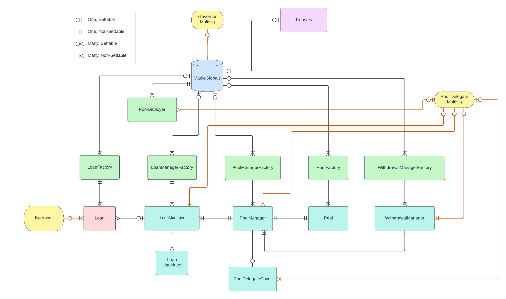

# Maple Finance 2.0 (V2)

Maple Finance brings legacy financial markets to the blockchain to be secured by blockchain technology. They offer permissioned and permissionless lending with permissioned borrowing.

## Calculation Methodology v1.0.0

### Total Value Locked (TVL) USD

Sum across all Pools:

`Pool Deposit TVL`

Note: in Maple V2 this is the amount of assets controlled by Pool Contracts

### Total Revenue USD

Sum across all Pools:

`(Accrued Interest in Loan Manager) + (Fees paid on Loan Repayments)`

### Protocol-Side Revenue USD

Sum across all Pools:

`(Fees paid on Loan Repayments)`

### Supply-Side Revenue USD

Sum across all Pools:

`(Accrued Interest in Loan Manager)`

### Total Unique Users

Count of Unique Addresses which have interacted with the protocol via any transaction

`Deposits`

`Withdrawals`

`Borrows`

`Liquidations`

`Repayments`

## Notes

- This protocol is on Solana and Ethereum, but subgraphs only support ethereum right now (2/7/23).
- Lending can be both Permissioned and Permissionless, but we put `PERMISSIONLESS` in the subgraph for now.
- Loans can be collateralized or uncollateralized on Maple. It is up to the Pool Delegates discretion. We put `UNDER_COLLATERALIZED` in the subgraph for now.
- There was a migration from V1 to V2 (see: https://etherscan.io/address/0x580b1a894b9fbdbf7d29ba9b492807bf539dd508).
  - Because of this deposits were transferred from the V1 contracts. We recognize the deposits as new deposits in V2.
  - Loans were also transferred from the V1 contracts. We recognize the loans as loans in V2. Payments will accrue revenue, and the loans will contribute to the borrow rates. But migrated loans are not considered new borrows initialized. The migrated loans count for `totalBorrowBalance`, but will not increment `cumulativeBorrowAmount`.
- Any liquidations that occur cannot be associated with a market or loan. If you find a way to do so, please let us know in a github [issue](https://github.com/messari/subgraphs/issues/new?assignees=bye43&labels=bug&template=bug_report.md&title=%23bug%3B+concise+title).
- Revenue (interest) is calculated as interest is accrued.
- Borrow rates are calculated based off the volume weighted average of the current outstanding loans.
- Deposit rates are calculated based off interest accrued on the current outstanding loans (minus fees). The supply rate is based off interest from the last 30 days.
- Borrow balance is the true outstanding balance of the loan (including interest).

## Links

Links to the relevant sources to learn about this protocol.

- Protocol: https://app.maple.finance/#/v2/lend
- Analytics: https://dune.com/scottincrypto/Maple-Deposits
- Docs: https://maplefinance.gitbook.io/maple/
- Smart contracts: https://github.com/maple-labs/maple-core-v2
- Deployed addresses: https://maplefinance.gitbook.io/maple/technical-resources/protocol-overview/protocol-registry

## Contract Relationship Map

A map of relationships between contracts and interactions

