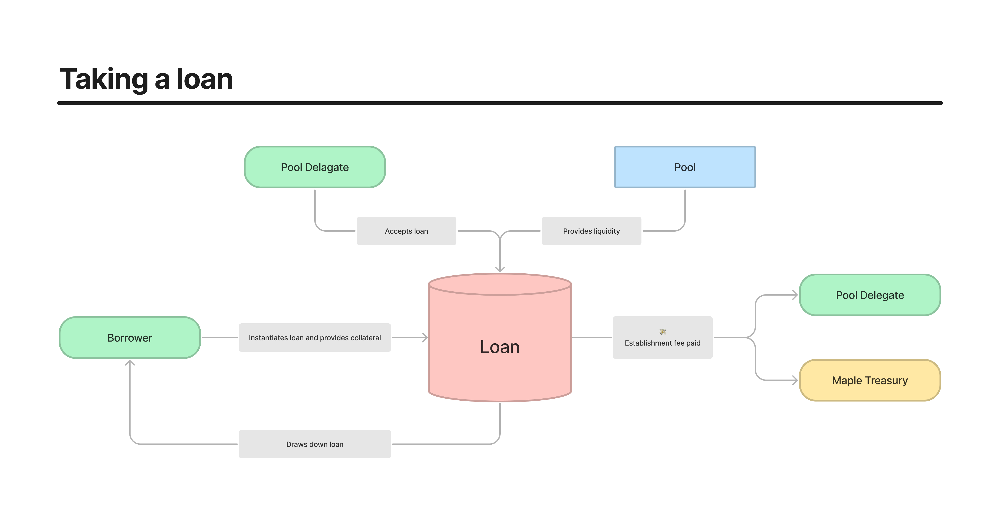

# Maple Finance Subgraph

## Calculation Methodology v1.0.0

Below, the methodologies for key fields in the protocol are surfaces for convience.

In depth methodologies for every parameter in the protocol can be found here: [Schema Map](https://fluffy-cobalt-78d.notion.site/Schema-Map-59607afc87ac4891a7dc8c407e18f48d)

### Market methodologies

#### Total Value Locked (TVL) USD

`outstanding loans + liquidity available to borrow as loan + staked assets balance providing cover to the market`

total amount on the supply side that is earning interest; it does not include accrued staking rewards

#### Cumulative Deposit USD

`sum of all deposits ever made to the market (pool)`

Does not include stake deposits since these are not loanable

#### Cumulative Withdraw USD

`sum of all withdraws ever been removed from the market (pool)`

Does not include stake deposits since these are not loanable

#### Total Deposit Balance USD

`Cumulative Deposit USD - Cumulative Withdraw USD - sum of all default suffered to the pool from defaulted loans`

#### Total Borrow Balance USD

`total borrow outstanding - all stake locker and pool losses from loan defaults`

Liquidated collatoral is interpreted the same as paying principal since form the pool perspective there is no difference. Losses to stake locker and pool are absorbed and removed from total borrow.

#### Cumulative Borrow USD

`Sum of all funded loan amounts from the Market (pool)`

#### Cumulative Liquidate USD

`Total losses suffered by stakers and lenders of the market from defaulted loans`

stake locker lossess + pool lossess. Collatoral liquidation is not counted towards cumulative liquidate and is instead considered the same as a prinicipal repayment since from the pool perspetive there is no difference.

#### Cumulative Supply Side Revenue USD

`sum of all interest paid and establishment fees paid to the Pool Delegate + sum of all interested earned by Lenders + sum of all interest earned by Stakers`

this doesn’t include MPL token distribution (optional APY boost) or profits earned by the Keeper for liquidations (V2 and V3 loans only)

#### Cumulative Protocol Side Revenue USD

`sum of all establishment fees from borrowers paid to Maple Treasury`

Fees are percentage of the drawdown amount; lump sum for V1 and V2 loans and amortized over repayments for V3 loans

#### Cumulative Total Revenue USD

`Cumulative Supply Side Revenue + Cumulative Protocol Side Revenue`

---

### Protocol methodologies

#### Total Value Locked USD

`sum of Total Value Locked USD for all markets in the protocol`

Sum of Protocol-Side Revenue USD for all markets

#### Total Deposit Balance USD

`sum of Total Deposit Balance USD for all markets in the protocol`

#### Cumulative Deposit USD

`sum of Cumulative Deposit USD for all markets`

#### Total Borrow Balance USD

`sum of Total Borrow Balance USD for all markets`

#### Cumulative Borrow USD

`sum of Cumulative Borrow USD for all markets`

#### Cumulative Liquidate USD

`sum of Cumulative Liquidate USD for all markets`

stake locker lossess + pool lossess for all markets (pools)

#### Cumulative Supply Side Revenue USD

`sum of Cumulative Supply Side Revenue USD for all markets`

#### Cumulative Protocol Side Revenue USD

`sum of Cumulative Protocol Side Revenue USD for all markets`

#### Cumulative Total Revenue USD

`sum of Cumulative Total Revenue USD for all markets`

## Protocol Diagrams

Diagrams of the protocol, specifically focusing on key things needed for the Subgraph. Each diagram follows this legend:

### Protocol Map

### Providing Liquidity Flow

### Staking Flow

### Taking Loan Flow

### Repaying Loan (Principal and Interest)

### Liquidation Flow

## Validation

Validation done for this subgraph can be found here: [Validation Spreadsheet](https://docs.google.com/spreadsheets/d/1viyui7nAzUXMx68EJSW61xC251uS8zpKePzV2xijjGQ/edit?usp=sharing)
