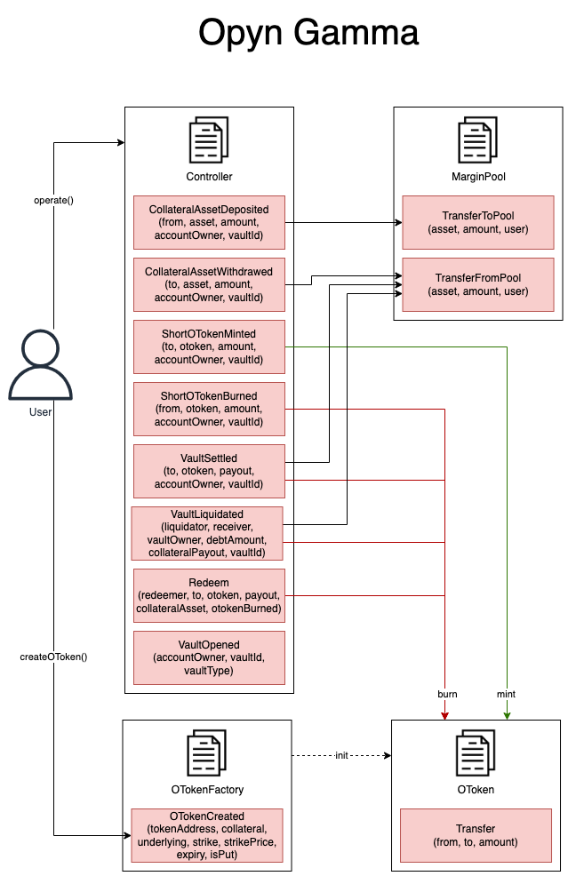

# Opyn Gamma

Opyn v2 offers European, cash-settled options that auto-exercise upon expiry. Cash settlement means that option holders don’t have to provide the underlying asset in order to exercise. Rather, the options are settled in the collateral asset, and option holders receive the difference between the price of the underlying asset at expiry and the strike price from option sellers.

## Calculation Methodology v1.0.0

### Total Value Locked (TVL) USD

Sum of all tokens currently deposited as collateral to mint options. Held in MarginPool contract.

### Open Interest USD

Current total value of all minted unexpired options in USD.

### Total / supply side / protocol side revenue

Not applicable, 0.

### Volume, cumulative / daily

Sum of all option values at the time of mint.

### Exercised volume

Sum value of profitable options at the time of expiry/exercise.

### Closed volume

Sum value of all options at the time of expiry.

### Total unique users

Count of unique addresses that have interacted with the protocol via any transaction.

#### Unique LPs

Count of unique addresses that have deposited collateral to a vault to mint options.

#### Unique Takers

Count of unique addresses that have received option tokens.

### Positions

Because options on Opyn are ERC20 tokens and can be traded on any decentralized exchange, there is no practical way to track all trade data.

Instead, positions are opened and closed based on ERC20 transfers. This means there is no data available for the price (premium) paid for the options tokens, only the value of the option tokens transferred. Additionally, since the option tokens are fungible, there can be multiple taken contracts (positions) for one minted contract.

In the case that a contract (position) expires worthless, there may be no update made to the position entity, in which case the expiry price and time can be found under `Position.option`.

### Liquidity Pools

Different options are grouped into Liquidity Pools by their collateral token.
For each pool, every option with a unique underlying asset, expiry date and type (put/call), will be recorded under `LiquidityPool.options`.

## Notes

Options are marked as closed once either:

1. A vault which minted the option is settled (and collateral is withdrawn)
2. Some of the option token is redeemed for the backing collateral (if the option expired in the money)

Because of this, there are a few expired options that are not marked closed.

## Links

Links to the relevant sources to learn about this protocol.

- Official frontend, outdated: https://v2.opyn.co/#/
- Alternative frontend: https://gammaportal.xyz/
- Docs: https://opyn.gitbook.io/opyn/
- Smart contracts: https://github.com/opynfinance/GammaProtocol/tree/v2.0.0/contracts
- Deployed addresses: https://opyn.gitbook.io/opyn/getting-started/abis-smart-contract-addresses
- Official subgraph: https://github.com/opynfinance/Gamma-Subgraph/

## Contract Relationship Map

