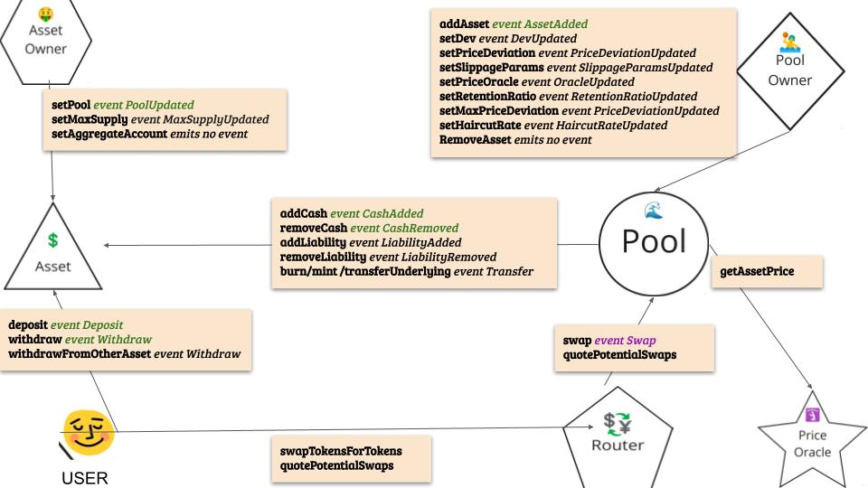

# Platypus Subgraph Methodology v1.0

The Platypus Finance protocol is a single-side AMM (decentralized exchange) designed for exchanging stable cryptocurrencies (ERC20 tokens) on the Avalanche blockchain.

The protocol is implemented as a set of smart contracts; designed to prioritize censorship resistance, security, self-custody and maximum capital efficiency. Platypus takes the early innovations of Curve Finance (ETH mainnet) and adds the twist of single-token staking and asset-liability management, in an attempt to fix issues related to impermanent loss and slippage.

## Useful Links

- Main Page
  - [https://www.platypus.finance/](https://www.platypus.finance/)
- Protocol
  - AMM: [https://app.platypus.finance/swap](https://app.platypus.finance/swap)
  - LPs: [https://app.platypus.finance/pool?pool_group=main](https://app.platypus.finance/pool?pool_group=main)
  - Staking (vePTP): [https://app.platypus.finance/stake](https://app.platypus.finance/stake)
- Docs
  - Liquidity Mining Yellow Paper: [https://cdn.platypus.finance/Platypus_Liquidity_Mining_Paper.pdf](https://cdn.platypus.finance/Platypus_Liquidity_Mining_Paper.pdf)
  - AMM Technical Specification Yellow Paper: [https://cdn.platypus.finance/Platypus_Liquidity_Mining_Paper.pdf](https://cdn.platypus.finance/Platypus_Liquidity_Mining_Paper.pdf)
  - [https://docs.platypus.finance/platypus-finance-docs/](https://docs.platypus.finance/platypus-finance-docs/)
  - [https://docs.platypus.finance/platypus-finance-docs/developers/contracts](https://docs.platypus.finance/platypus-finance-docs/developers/contracts)
- Smart contracts
  - [https://github.com/platypus-finance](https://github.com/platypus-finance)
- Deployed addresses
  - [https://docs.platypus.finance/platypus-finance-docs/developers/contract-addresses](https://docs.platypus.finance/platypus-finance-docs/developers/contract-addresses)
- Airdrop Site
  - [https://airdrop.platypus.finance/](https://airdrop.platypus.finance/)
- Treasury
  - [https://gnosis-safe.io/app/avax:0x068e297e8FF74115C9E1C4b5B83B700FdA5aFdEB/balances](https://gnosis-safe.io/app/avax:0x068e297e8FF74115C9E1C4b5B83B700FdA5aFdEB/balances)
- Coverage Ratio & APR Example
  - [https://docs.platypus.finance/platypus-finance-docs/concepts/platypus-interest-rate-model](https://docs.platypus.finance/platypus-finance-docs/concepts/platypus-interest-rate-model)
- Medium
  - [https://medium.com/platypus-finance](https://medium.com/platypus-finance)
- Messari Profile
  - [https://messari.io/asset/platypus-finance](https://messari.io/asset/platypus-finance)

## Usage Metrics

**Active Users, Total Unique Users & Daily Transaction Count**

Transactions of interest on Platypus include:

- Depositing any token into its liquidity pool to gain LP Token
- Staking LP token to Liquidity Mine PTP
- Staking PTP for vePTP
- Swapping one stablecoin for another (Stableswap)

Any address which conducts one of the transactions above should be considered a User.

All unique addresses that have participated in any of the above accounts should be considered in the Total Unique Users Calculation. Furthermore, a 24-hour lookback period should be used to determine Daily Transaction Count.

**Total Swap Volume**

Total Volume on Platypus would be total amount (in USD) swapped across all assets available.

`Sum of swap volume across liqudity pools.`

**Total LP Volume**

Given that Platypus allows users to add single-sided (as opposed to paired liquidity), Total LP Volume would be total deposits into any asset liquidity pool (across Main, Alt and Factory Pools) on the Platypus platform.
Sum of LP volume across liqudity pools

**Total Staked Volume (PTP and vePTP)**

In order to mine the PTP token, users must stake their LP tokens after depositing into a liquidity pool. Process is as follows:

User deposits USDC into Main Pool-> User received single-sided LP Token (USDC on Main Pool) -> User stakes single-sided LP Token-> User receives emissions in PTP based on volume, coverage ratio of asset and APR

Total Staked Volume (PTP) would be total LP tokens staked in on Platypus. This will likely be a % of Total LP Volume, and a **% of Staked/LP** would be an interesting metric as well.

Discussed under Reward Tokens below, but Platypus incorporates a veCRV model to boost PTP emissions at the pool level. After a user receives PTP from the LP staking process outlined above, they have the ability to further stake their PTP tokens to generate voting-escrowed PTP (vePTP). vePTP is non-tradeable or transferable and is used to boost PTP-rewards for LP stakers.

The amount of staked vePTP changes the total PTP rewards given to each pool. Our implementation uses `AdjustedAllocationPoints` from the `MasterPlatypusContract` which is updated whenever the staked vePTP balance changes.
However we are not tracking the amount of vePTP staked or its balances, as it is non-transferable and doenst have any market value.

## Financial Metrics

**Total Value Locked USD**

The Total Value Locked (TVL) on Platypus can be calculated by summing the total deposits across all pools (Main, Alt & Factory Pools) on Platypus. We leverage the LP-Pools from [this list](https://docs.platypus.finance/platypus-finance-docs/developers/contract-addresses).

\_Note: \_DeFi Llama utilizes the above calculation; **however, **user’s can toggle TVL to include staking. If Messari were to want TVL both inclusive and exclusive of staking, they would take the TVL calculation laid out above and add Total Staked Volume metrics shown under Usage.

_TVL (non-staking): All LP deposits across main, alt and factory pools_

\_TVL (staking): TVL (non-staking) + Total Staked Volume (PTP)\_

**Protocol Controlled Value USD**

As a DEX, and more specifically a StableSwap protocol, Platypus does not require a PCV to back its token. Token price should be based on total trading volume, fees, etc.
The the Protocol Controlled Value is thus the same as Protocol Side Revenue, which stays in the liquidity pool but is yet to be distributed to either the protocol admin or the supply side.

**Supply Side Revenue**

As with most DEXs, supply side revenue is generated for LPs through a % of transaction fees as a function of one’s % of total liquidity added to a pool. By depositing liquidity, an individual may farm the PTP governance token once liquidity mining, or share the **haircut fee** of the transaction fee collected from each asset swap depending on the retention ratio.

The split between Supply Side revenue and Protocol Side revenue depends on the retention ratio, the ratio for each pool is 100% meaning the supply side revenue is 0 unless the team changes it in the future.

\_SupplySideRevenue = Total Revenue \* (( 100 - Retention Ratio ) / 100)\_

**Protocol Revenue:**

_Swap Fees_

Within its main function as a DEX, Platypus charges a transaction fee on all swaps on the platform. This relatively small fee can be changed via governance.

For each type of pool there is a different haircut according to the docs, but this may vary from the haircut rate set on the contracts. Our implementation uses the retention ratio and haircut rate from the actual deployed contracts.

In order to calculate the total swap revenue for the protocol you would perform the following calculation:

\_SwapFees = Total Revenue \* ( Retention Ratio / 100 )

_Withdrawal / Deposit Fees_

Given the nature of Platypus’ single-side LPs, they opened themselves up to unique arbitrage risk, outlined [here](https://medium.com/platypus-finance/withdrawal-arbitrage-the-risk-of-platypus-attacks-bc3e43e69fcb). To combat this arbitrage, they have instituted withdrawal and deposit fees, which also provides a _small_ source of revenue.

Our implementation doesnt track the withdrawal and deposit fee charged as the contracts provide no simple way to get this information and a lots of computation would be required to calculate the dynamic fee based on slippage and coverage ratio of each asset in a pool.

These fees are based on the coverage ratio of the pools. For Example:

<table>
  <tr>
   <td>Coverage Ratio
   </td>
   <td>Withdrawal Fee
   </td>
  </tr>
  <tr>
   <td>>=1
   </td>
   <td>-0.0000%
   </td>
  </tr>
  <tr>
   <td>0.9
   </td>
   <td>-0.0011%
   </td>
  </tr>
  <tr>
   <td>0.8
   </td>
   <td>-0.0093%
   </td>
  </tr>
  <tr>
   <td>0.7
   </td>
   <td>-0.0518%
   </td>
  </tr>
  <tr>
   <td>0.6
   </td>
   <td>-0.2731%
   </td>
  </tr>
</table>

_Protocol Revenue = Transaction Fees \* (Retention Ratio /100) + Withdrawal Fees + Deposit Fees_

Since we are not tracking Withdrawal and Deposit Fees

_Protocol Revenue = Transaction Fees \* (Retention Ratio /100)_

**Treasury Yield Revenue:**

Platypus also generates revenue by yield farming its treasury. This is currently mostly composed

of its native token, PTP. Platypus can deploy these assets to generate yield and increase the existing treasury.

## Pool-Level Metrics

**Coverage Ratio **

_not tracked_
Ratio of single-sided asset to each other in every pool
The higher the coverage ratio, the greater the PTP emission is to the stablecoin account.

**Pool Total Value Locked USD**

Total deposits in a pool
`` Calculated as the sum of `cash` across each asset. ``

**Reward Tokens & Reward Token Emissions Amount**

Platypus delivers its native token PTP through three different pool for liquidity mining: namely the **Base Pool, Boosting Pool and AVAX-PTP Pool (Pool 2)**, accounted for 30%, 50%, and 20% of the liquidity emission, respectively.

**Base Pool:**

The Base Pool issues PTP tokens to a deposit at an amount that is positively proportional to its share of the aggregate deposit. The token emission for a deposit in the base pool is defined as:

    _Token Emissions (per Deposit) = Emissions Allocated to the Account * (Deposit Amount / Aggregate Deposits in Account)(_

**Boosting Pool:**

The Boosting Pool utilizes an additional token, voting escrow PTP (vePTP), inspired by voting escrow CRV ([veCRV](https://resources.curve.fi/base-features/understanding-crv)) of Curve Finance. Have a look at the below vePTP attributes :

- 1 staked PTP generates 0.014 vePTP every hour
- Maximum vePTP held with a deposit equals to 100 times PTP staked for the deposit
- Upon unstaking PTP, vePTP drops to 0
- vePTP is non-transferable and non-tradeable due to the design of the smart contract, i.e. vePTP token will be locked in the private wallet of the user

The weight function and number of PTP token emission for the boosting pool is defined as:

_w=sqrt{deposit\*vePTP}_

_PTP token emission for a deposit=Emission Allocated to the account∗(Deposit Weight/Aggregate Weights in the Account) _

We dont need to track the deposit for each account, as we are returning the overall PTP emitted for each Asset in each Pool.

## Various Types of Pools in Platypus

### Main Pool

This the main driver of TVL on the platform. It contains all the battle tested stablecoins like DAI.e, USDT.e, USDT, among others. MIM was a part of the main pool before it was moved to a Alt pool of its own. Our implementation tracks this effectivly.

### Alt Pool

These are pools that are spun up for compartivly risky assets such as UST and MIM. Each Alt pool contains 2 assets which are supposed to be of same value like the USDT/MIM Alt Pool and the sAVAX/wAVAX Alt Pool. ALthough these assets are risky, and a depeg of an asset in ALT would result in the pool not accepting new trades / deposits / withdraws.

### Factory Pool

Factory pools are like Alt pool as in they are created for risky assets, but they have the depeg protection turned off. This means that the pool will remian functional even if the asset depegs from its desired value. These are new pools that are additionally rewarded by external tokens (mostly by the creator of the risky stablecoin).
Currently there are 3 Factory Pools. (Eg: H20/USDC Pool)

#### Note abount deprecated and "False Pools"

The admin has for operational reasons changed the pool for an asset to their own address or the Platypus Multisig to carry out specific functions only allowed to be done by the pool. This causes "false pools" to be added to the subgraph. These pools are hardcoded to be ingored and do not contribute to the TVL or other metrics of the protocol. These are also not counted when we count the number of pools in the protocol.
Deprecated Pools (like an Old MIM pool) are also ignored and as named as "Withdraw Pools" in the subgraphs, as they only allow withdraws and no other functions.

## Interaction Diagram

