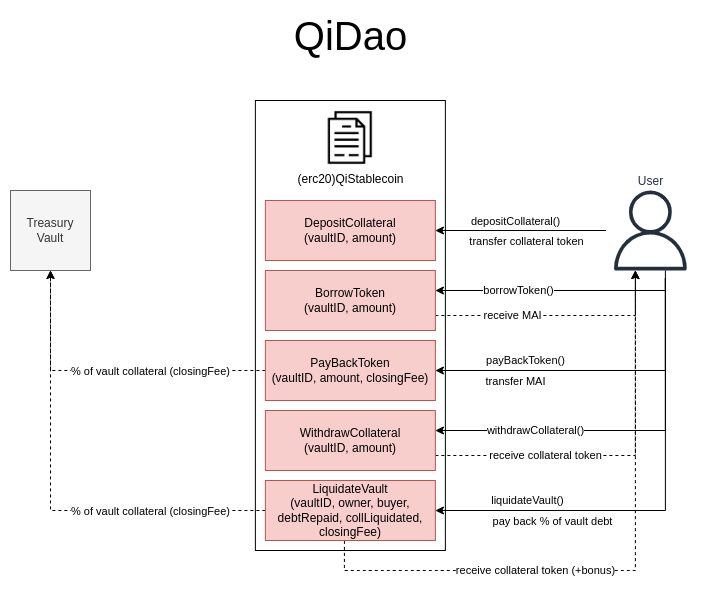

# QiDAO Subgraph

## Smart Contracts Interactions

## Calculation Methodology v1.0.1

## Introduction

QiDAO is a decentralized stablecoin lending protocol launched on Polygon. It has since then expanded to other large chains such as Fantom, Optimism, and Avalanche. The DAO’s core mission is to provide easily accessible, zero interest lending on crypto assets through the issuance of their overcollateralized stablecoin, MAI. [Mai Finance](https://app.mai.finance/) is the front end application to the QiDAO protocol. Community members can vote on governance issues of the protocol through ownership of the Qi token. Qi stakers earn a portion of the protocol's revenues. They may also lock their tokens for greater voting power and larger emission shares. 

## Useful Links

* Protocol
    * [Mai Finance/QiDAO Homepage](https://app.mai.finance/) 
* Documentation
    * [Mai Finance/QiDAO Docs](https://docs.mai.finance/)
* Contracts
    * [QiDAO Smart Contract Addresses](https://docs.mai.finance/functions/smart-contract-addresses#qi-addresses)
* Github
    * [QiDAO Github](https://github.com/0xlaozi/qidao) 
* Analytics
    * [Mai Finance Analytics Page](https://app.mai.finance/analytics) 
    * [Defi Llama QiDAO TVL](https://defillama.com/protocol/qidao/all/USD)
* Socials
    * [QiDAO Discord](https://discord.gg/mQq55j65xJ) 
    * [QiDAO Twitter](https://twitter.com/QiDaoProtocol) 

## Usage Metrics

**Active Users, Total Unique Users & Daily Transaction Count**

Users of QiDAO are those taking the following actions:

* Create Vault
* Deposit Collateral (Vault/Yield)
* Withdraw Collateral (Vault/Yield)
* Borrow Stable 
* Repay Stable
* Liquidate Vault

Additional usage metrics

* Total MAI borrowed
* Average Collateralization Ratios (overall, per asset)
* Average Loan Amounts (overall, per asset)
* Liquidations (total amount, count, average)
* Voting Incentive Participation (percent of QI holders, vote distribution)

## Financial Metrics

**Note**: The following calculations and equations have been based on the native chain for the protocol, Polygon. Other chains may lack certain features, such as no QI staking (only on Polygon) or Yield Instruments (e.g. camtokens derived from amtokens on AAVE). In these cases these parts of the equation will just amount to zero. None of the equation components will become undefined as a result of this, so the equations can still be used for any chain.

**Total Value Locked USD** 

The TVL of QiDAO can be calculated as follows:

`TVL(USD) = Vault Deposits + Pool Deposits + Yield Instrument Deposits + Staking Deposits`

**Protocol Controlled Value USD**

QiDAO first ran a 1 month bond trial with [QIP046](https://vote.mai.finance/#/proposal/0x62f86016ada3a58dd49d30bc4cbf8d9f98906069db87064fd2c9de09fbc6f920). The trial has since ended, and bonds are not available. It is possible it could reopen in the future. At the time of writing, the DAO holds LP positions on SushiSwap and QuickSwap in their treasury. The PCV can be calculated as:

`Protocol Controlled Value (USD) = Sum of LP Held (USD)`

Some wallets they hold PCV:

Polygon Treasury Management Contract [0x3feacf904b152b1880bde8bf04ac9eb636fee4d8](https://debank.com/profile/0x3feacf904b152b1880bde8bf04ac9eb636fee4d8) 

Polygon Treasury [0xc63c477465a792537d291adb32ed15c0095e106b](https://debank.com/profile/0xc63c477465a792537d291adb32ed15c0095e106b) 

**Total Revenue USD**

The total revenue can be calculated by summing the

1. Vault Incentive Emissions
2. Yield from LP Pools
3. Interaction fees (repay, swap, lp deposit, liquidations)

`Total Revenue (USD) = Vault Incentives + Pool Yield + Fees`

**Supply Side Revenue USD**

Supply side revenue can be determined by omitting the interaction fees that go to the protocol, but adding rewards for QI stakers. In the Qi Powah Boost program, stakers are rewarded 30% of repayment fees (when a user repays their loan), and 100% of Qi-MATIC pool rewards (see Protocol Revenue for protocol fee breakdown). [WMATIC-QI Pair on QuickSwap](https://info.quickswap.exchange/#/pair/0x9a8b2601760814019b7e6ee0052e25f1c623d1e6) 

`Supply Side Revenue (USD) = Vault Incentives + Pool Yield + Staking Rewards`

(See Protocol Revenue below for staking rewards calculation.)

**Protocol Revenue USD**

How does QiDAO make revenue? 

QiDAO offers 0% interest on all loans, so they don’t make revenue off lending interest. Instead, they charge fees on certain interactions users make when using the protocol. The protocol also doesn’t take any liquidation fees from liquidators, only the repayment fee when the liquidators repay undercollateralized loans. The breakdown:

- Repayment fees (0.5%)

- Anchor Swap fees (1%) note: Anchor is their in-app swap 

- LP Deposit fees (0.5%)

The DAO also holds a small amount of PCV in the form of LP.

Protocol Revenue equation:

`Protocol Revenue (USD) = Repayment Fees - Staking Rewards + Swap Fees + LP Deposit Fees + PCV Yield`

With 30% of Repayment Fees awarded to Qi stakers and 100% of Qi-MATIC yield,

`Staking Rewards = (0.3 * Repayment Fees) + QiMaticYield`

`Protocol Revenue (USD) = (0.7 * Repayment Fees) - QiMaticRewards + SwapFees + LPDepositFees + PCVYield`

Substituting in fee breakdown, we can rearrange to

`Protocol Revenue (USD) = 0.7 * (RepaymentVolume * 0.005) + (SwapVolume * 0.01) + (LPDepositVolume * 0.005) + PCVYield - QiMaticYield`

where percentage multipliers, and staking reward LP pool share are subject to change with DAO policy.

## Pool-Level Metrics

**Pool Total Value Locked USD**

Across all of QiDAO’s vaults and staking pools, the TVLs can be calculated as normal: 

`Vault Pool TVL (USD) = (Sum of Tokens) * (Price of asset)`

In the LP Pools, TVL is the sum of each token times their respective price

`LP Pool TVL (USD) = (Sum of Token1 * PriceToken1) + (Sum of Token2 * Price of Token2)`

**Reward Tokens & Reward Token Emissions Amount**

Qi Contract launched on Polygon block 14086042, time 2021-05-04 16:21:11 UTC.

Max supply of Qi tokens (hard cap): **200M**

Circulating Supply: **80,223,758** (2022-05-23)

Strategic partners: 5% released linearly for 1.5 years

Keeper allocation: 10% total vested over 3 years

Community Distribution: 85% (includes vault, LP incentives)

Vault incentives are allocated a total of 0.65 Qi per block, or around 180k Qi per week ([QIP104](https://snapshot.org/#/qidao.eth/proposal/0x64461eed3df8ec4339975c0ad4d80820ba454756e30f48e575baa0905c4f6de6)). The distribution of these rewards among vaults are decided every two weeks by the DAO. The final percent distribution of votes equals the percentage of rewards allocated to each collateral type. The [Vault Incentives Page](https://app.mai.finance/vault-incentives) has a detailed breakdown of the incentive distribution.

QiDAO has held numerous incentive programs on various platforms to incentivize the expansion of MAI. The following list has been curated manually from the DAO’s proposal snapshot voting history, which may not be comprehensive, and only has vote start and end times but not when exactly the incentive programs were implemented. Durations of programs unclear to be verified, whether program incentives are still ongoing can still be determined by checking the pools on the respective protocols and chains. (note to reviewer, please let me know if this work is required)

* [QIP014](https://vote.mai.finance/#/proposal/QmXz4Stz71nEgzsADZ1wbhABpNHTVdSBjSba9ofjMgMMht), vote passed 2021-08-07 17:00 UTC
    * 0.05 Qi/block for vault MAI borrowing incentives 
* [QIP035](https://vote.mai.finance/#/proposal/0xc055a12ce7015e4f482788141d9bdd6bf9f70102c0c290300b8a64f2defa2fbe), vote passed 2021-11-01 07:00 UTC
    *  Fantom Beethoven X
        * 15k Qi/week for MAI-USDC 
        * 10k Qi/week for QI-FTM
            * Additional rewards in beets
* [QIP038](https://vote.mai.finance/#/proposal/0x0be62af9a4edbfeed0d6aae2e41392fc29300c85a86b30fafadcbb2e722c0baf), vote passed 2021-11-20 10:59 UTC
    * Qi LP incentives
        * 20k Qi/week for MAI-3CRV on Curve 
            * Additional rewards in CRV
        * 10k Qi/weekQI-AVAX on Trader Joe 
            * Additional rewards in JOE
* [QIP046](https://vote.mai.finance/#/proposal/0x62f86016ada3a58dd49d30bc4cbf8d9f98906069db87064fd2c9de09fbc6f920), vote passed 2021-12-16 23:00 UTC
    * 400,000 Qi for bonds over one month
    * 3000 QI/week for MAI Liquidity on BNB
* [QIP059](https://vote.mai.finance/#/proposal/0x80a67737939c743ef655dfc2e125238abb50421e5409e6c7425933661a651349), vote passed 2022-01-22 19:00 UTC
    * Fantom and Polygon Curve LP incentives, 50k Qi/week per pool 
* [QIP091](https://vote.mai.finance/#/proposal/0x06b8dc7aebff9beeb6608a782bb53f5dbc7c3b00b3a8e5a652af09bd9e6d2935), vote passed 2022-04-27 04:00 UTC
    * 3,000 QI / week to MAI+val3EPS (BUSD+USDC+BUSD-T) on Ellipsis
        * Additional rewards in $EPS and $VALAS tokens
