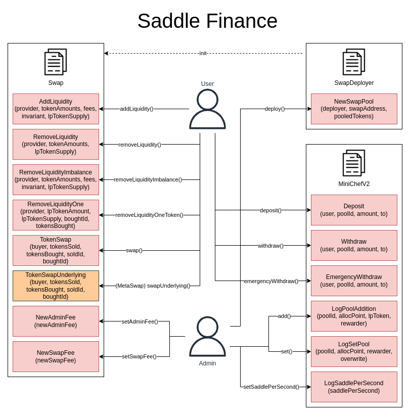

# Saddle Finance (DEX) Subgraph

## Calculation Methodology v1.0.0

### Total Value Locked (TVL) USD

Sum across all Pools:

`Liquidity Pool TVL`

### Total Revenue USD

Sum across all Pools:

`(Swap Trading Volume * Pool Swap Fee)`

Note:

- The Pool Swap Fee + Pool Admin Fees can be dynamically updated from pool-to-pool
- Excludes flash loans

### Protocol-Side Revenue USD

Portion of the Total Revenue allocated to the Protocol

Sum across all Pools:

`(Swap Trading Volume * Pool Swap Fee * Pool Admin Fee)`

Note: The Pool Swap Fee + Pool Admin Fees can be dynamically updated from pool-to-pool

### Supply-Side Revenue USD

Portion of the Total Revenue allocated to the Supply-Side

Sum across all Pools

`(Swap Trading Volume * Pool Swap Fee * (1 - Pool Admin Fee))`

Note: The Pool Swap Fee + Pool Admin Fees can be dynamically updated from pool-to-pool

### Total Unique Users

Count of Unique Addresses which have interacted with the protocol via any transaction

`Swaps`

`Deposits`

`Withdraws`

### Reward Token Emissions Amount

`Reward Token Emission Rate Per Second * (seconds in day)`

### Protocol Controlled Value

To be added

### Pool Output Token Price

`(Sum of input token balances in USD) / (LP token supply)`

Note: All pegged value asset prices are set to underlying asset price

## Smart Contract Interactions

## References and Useful Links

- Protocol website: https://saddle.finance/
- Protocol documentation: https://docs.saddle.finance
- Smart contracts: https://github.com/saddle-finance/saddle-contract/
- Deployed addresses: https://docs.saddle.finance/contracts
- Existing subgraph: https://thegraph.com/hosted-service/subgraph/saddle-finance/saddle
