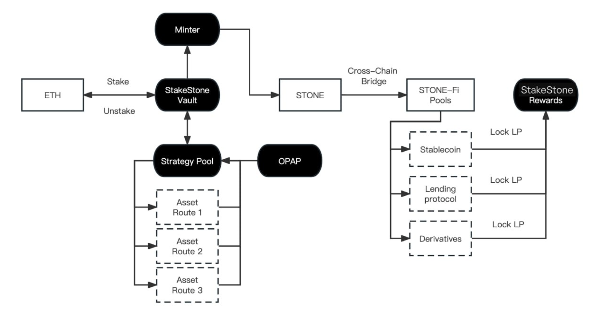

# Stakestone Subgraph

## Methodology v1.0.0

StakeStone is an omni-chain LST (Liquid Staking Token) protocol aiming to bring native staking yields and
liquidity to Layer 2s in a decentralized manner. With its highly scalable architecture, StakeStone not only
supports leading staking pools but is also compatible with the upcoming restaking. Meanwhile, it establishes a
multi-chain liquidity market based on STONE, StakeStone’s native LST, provides users of STONE with more use
cases and yield opportunities.

Based on LayerZero, STONE is a non-rebase OFT (Omnichain Fungible Token) that supports both assets and
prices to be transferred across multiple blockchains seamlessly.

## Metrics

### Usage and Transactions

- Deposits into AssetVault
- Withdrawals from AssetVault

### TVL

Total ETH deposited to mint STONE (or assets in AssetVault and StrategyController contracts).

### Fees and Revenue

There are no additional fees excluding the basic transaction gas fee.

## Useful Links

- Landing Page: https://stakestone.io/
- Staking App: https://app.stakestone.io/u/stake
- Docs: https://docs.stakestone.io/stakestone
- Contracts: https://docs.stakestone.io/stakestone/developers/smart-contracts-address
