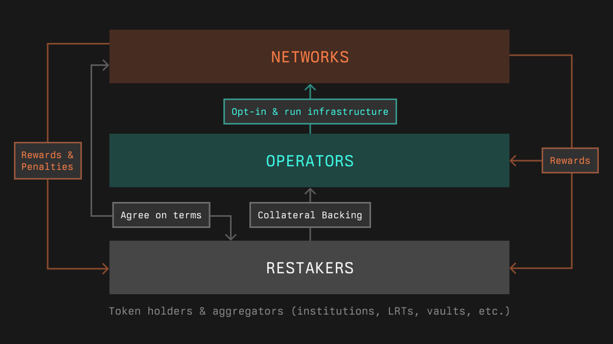

# Symbiotic Subgraph

## Methodology v1.0.0

Symbiotic is a shared security protocol that serves as a thin coordination layer, empowering network builders to control and adapt their own (re)staking implementation in a permissionless manner.

## Metrics

### Usage and Transactions

- Collateral tokens are minted by users with assets or positions they seek to restake. Collateral tokens are then deposited into vaults, which delegate collateral to operators across Symbiotic networks.
- The user can claim the withdrawal when the EPOCH + 1 ends. Hence, a withdrawal delay varies from EPOCH + 1 to 2⋅EPOCH. Such funds are immediately reduced from the active balance of the vault.

### TVL

Total collateral tokens minted.

### Fees and Revenue

Currently the protocol does not charge a fee, and makes no revenue.

## Useful Links

- Landing Page: https://symbiotic.fi/
- Restaking App: https://app.symbiotic.fi/restake
- Docs: https://docs.symbiotic.fi/
- Contracts: https://docs.symbiotic.fi/deployments
