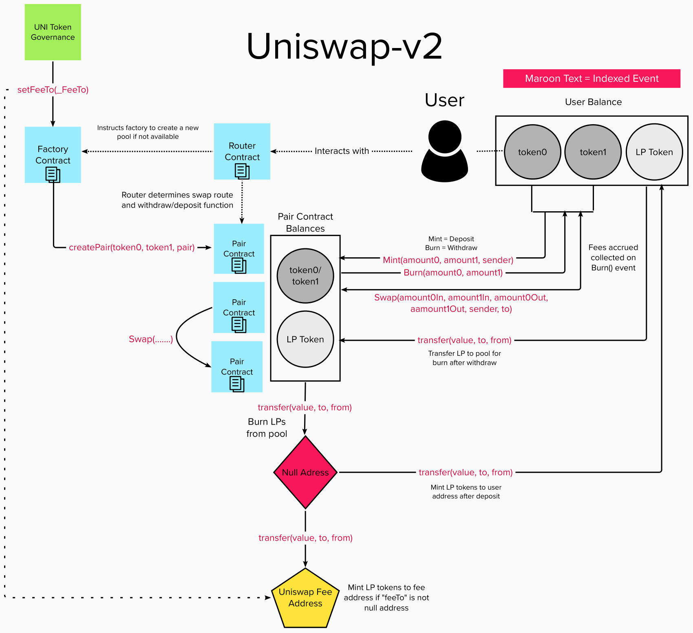

# Uniswap v2 Subgraph

## Calculation Methodology v1.0.0

### Total Value Locked (TVL) USD

Sum across all Pools: 

`Liquidity Pool TVL`

### Total Revenue USD

Sum across all Pools:

`(Swap Trading Volume * Total Swap Fee)`

Note that the Total Swap Fee for Uniswap_v2 is currently 0.3% and cannot be changed via Governance (04/07/22)

### Protocol-Side Revenue USD
Portion of the Total Revenue allocated to the Protocol

Sum across all Pools:

`(Swap Trading Volume * Total Swap Fee * Protocol Share) or (Swap Trading Volume * Protocol Swap Fee)`

Note that the Protocol Swap Fee for Uniswap_v2 is currently 0% and can be changed via Governance (04/07/22)

### Supply-Side Revenue USD
Portion of the Total Revenue allocated to the Supply-Side

Sum across all Pools

`(Swap Trading Volume * Total Swap Fee * (1- Protocol Share)) or (Swap Trading Volume * LP Swap Fee)`

### Total Unique Users

Count of  Unique Addresses which have interacted with the protocol via any transaction

`Swaps`

`Deposits`

`Withdraws`

###  Reward Token Emissions Amount

To be added

###  Protocol Controlled Value

To be added

## References and Useful Links

Other existing subgraph
https://thegraph.com/hosted-service/subgraph/uniswap/uniswap-v2

## Smart Contracts Interactions

