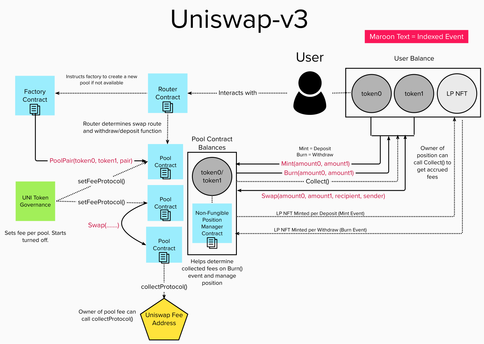

# Uniswap v3 Subgraph

## Optimism Regenesis

Because of a regenesis event on Optimism, many of the liquidity pools have to be manually instantiated at the start of the program. This is because all of the liquidity pool contracts that were created before regenesis do not have a corresponding event from the factory contract upon indexing the post-regenesis chain. The state of these contracts were maintained, however, we are not able to recover volume, fee, swap, deposit, and withdraw data from before regenesis.

More Info:
https://blog.synthetix.io/optimism-mainnet-upgrade-scheduled-downtime-and-regenesis/

## Calculation Methodology v1.0.0

### Total Value Locked (TVL) USD

Sum across all Pools:

`Liquidity Pool TVL`

### Total Revenue USD

Sum across all Pools:

`(Pool Swap Trading Volume * Pool Fee Tier)`

Note that Pool Fee Tiers vary by pool and more tiers could be added by Governance (04/07/22)

### Protocol-Side Revenue USD

Portion of the Total Revenue allocated to the Protocol

Sum across all Pools:

`(Pool Swap Trading Volume * Pool Fee Tier * Protocol Fee)`

Note that the Protocol Fee for Uniswap is currently 0% but could be changed via Governance (04/07/22)

https://uniswap.org/blog/uniswap-v3

### Supply-Side Revenue USD

Portion of the Total Revenue allocated to the Supply-Side

Sum across all Pools

`(Pool Swap Trading Volume * Pool Fee Tier * (1 - Protocol Fee))`

Note that Pool Fee Tiers vary by pool and more tiers could be added by Governance (04/07/22)

### Total Unique Users

Count of Unique Addresses which have interacted with the protocol via any transaction

`Swaps`

`Deposits`

`Withdraws`

### Reward Token Emissions Amount

Does not apply to Uniswap V3

### Protocol Controlled Value

Does not apply to Uniswap V3

## References and Useful Links

Other existing subgraph
https://thegraph.com/hosted-service/subgraph/uniswap/uniswap-v3

## Smart Contracts Interactions

